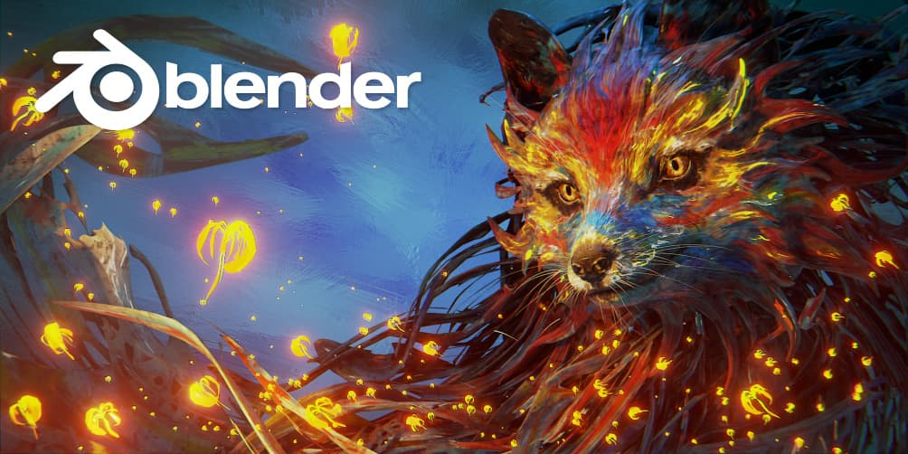
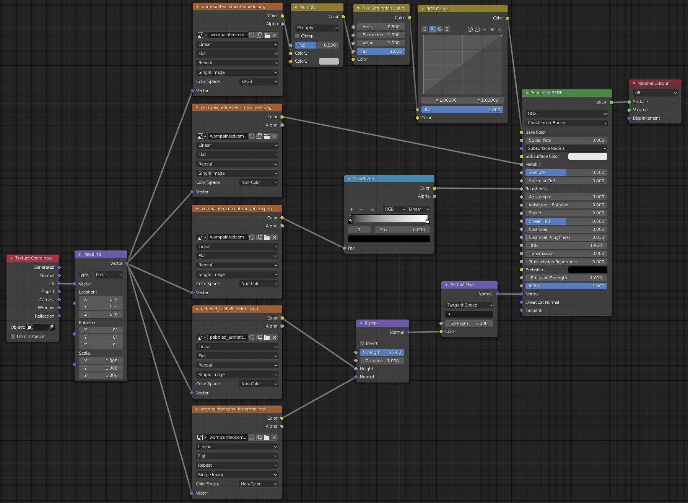
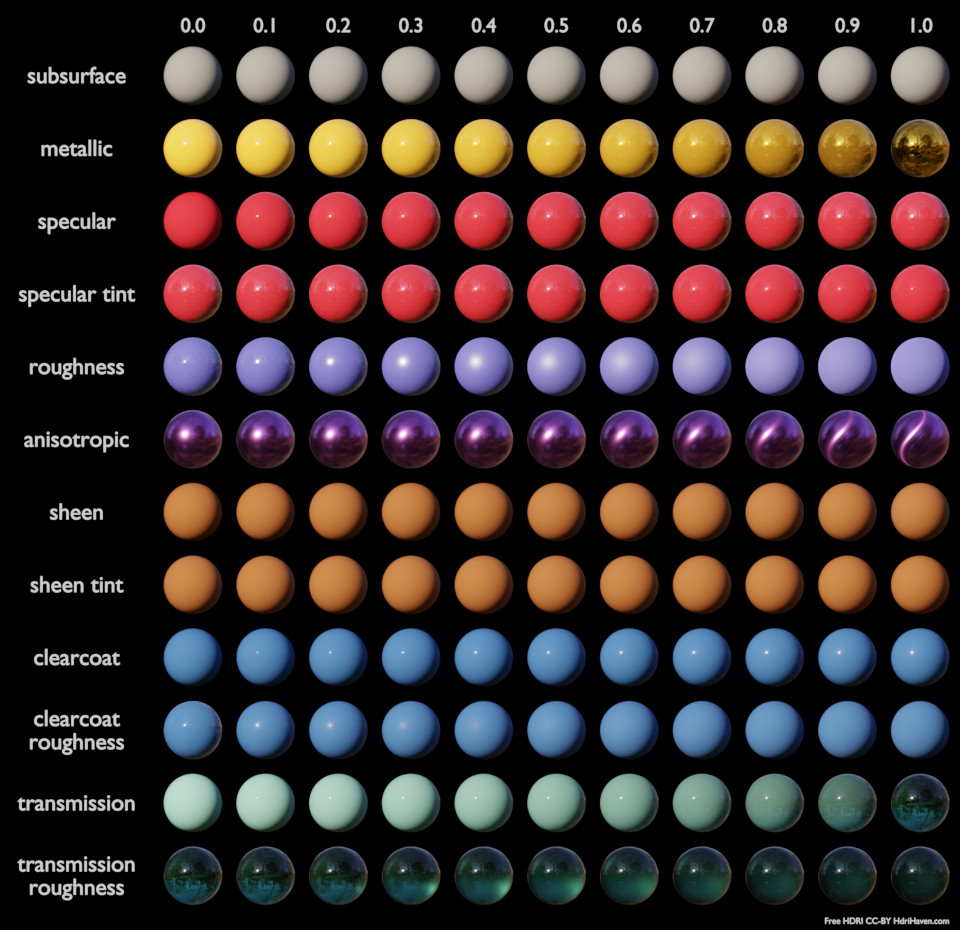

## Increasing Performance

* Turn off statistics (surprisingly grants big boost)
* When possible apply modifier
* When sculpting use multires modifier
* Disable objects from viewport (display symbol)
* Don't overdo it with subD levels and rather increase render SubDiv levels

## Cleaning Up Interface

* Enter Fullscreen mode (Window > Toggle Windowed Fullscreen)
* Maximize current window inside of Blender (Ctrl + Space)
* Hide left and right tabs (T & N)
* Toggle visible gizmos in viewport (Viewport Gizmos (menu)). Things to turn off: Navigate
* Toggle overlays in viewport (Viewport Overlays (menu)). Things to turn off: Grid, Floor, Axes X Y Z, Text Info
* Right-click on the header to disable parts at the top

## Blender Color Spaces

:::note[sRGB] 
:::

:::note[Raw] 
:::

:::note[Non-Color]

* Used for images that don't actually contain color data

:::

:::note[Linear ACES] 
:::

:::note[Linear]

* Used for EXR images
* Best for rendering and compositing
* Corresponds more closely to nature
* Doesn't directly correspond to human perception & display devices

:::

:::note[Filmic Log] 
:::

## Fixing Issues in Blender

### General

* If any modifier or action aren't working properly it might be because one or multiple transforms should be applied first
* Check if the origin / world origin is at the desired location if a modifier or action fails
* Maybe there are vertices that overlap each other but aren't connected (fix with: Ctrl + M > Merge by distance)
* Check if face orientation is correct (Viewport Overlays > Face Orientation)
* Bad topology, quads work best with all modifiers and actions
* Sometimes shading looks bad because viewport shading options like cavity are on
* For curves it's good to turn on handles (Edit Mode > Viewport Overlays > Handles / Handles Normals)

### Fixing Shading

* Shade smooth
* Turn on auto smooth / change degree amount (Object Data Properties: Normals > Auto Smooth)
* Average face Area (Alt + N)
* Make sure normals are facing the correct direction
* Use weighted normal modifier
* Use data transfer modifier
* Use Hard Ops Sharpen

## Shader Nodes

### Basic PBR Material Setup

### Principled Shader Nodes

The Principled BSDF Node is a combination of many other Principled nodes, which means that in theory you don't need to use the Principled BSDF but can simply put together other Principled nodes. This can sometimes be desired, especially in game engines, when you want a performant and simple node setup and don't need the sheen for example. The Principled BSDF is built in such a way to accommodate the metallic workflow.

:::tip[Principled BSDF]

* Base Color >>> Color
* Subsurface >>> Sub Surface Scattering
* Metallic >>> The metallicness of an object
* Specular >>> How much reflection is possible
* Specular Tint >>>
* Roughness >>> Increase / decrease sharpness of light reflection
* Anisotropic >>> Amount of anisotropy for specular reflection. Higher values give elongated highlights along the tangent direction (Cycles only)
* Anisotropic Rotation >>> Rotates the direction of anisotropy (Cycles only)
* Sheen >>> For cloth like materials near edges
* Clearcoat >>> Adds glossy specular layer on top of everything (used for car / boat paint)
* IOR >>> Index of refraction for transmission
* Transmission >>> turn material in glass like object
* Emission / Emission Strength >>> The color and strength of the emitted light (bloom needs to be enabled for this to work properly)
* Alpha >>> Transparency/Opacity/Alpha (not translucency)
* Normal >>>
* Clearcoat Normal >>> Controls the normals of the Clearcoat layer
* Tangent >>> Controls the tangent for the Anisotropic layer

:::

:::tip[Principled Glossy]

* Metals
* Mirrors
* Plastic

:::

:::tip[Principled Diffuse] 
:::

:::tip[Principled Hair BSDF]

* Hair cards
* Particle hair

:::

:::tip[Emission]

* Lights
* Emissive objects

:::

:::tip[Principled Specular]

* Uses the old specular workflow

:::

:::tip[Principled Volume]

* Smoke

:::

### Color Correction

:::tip[Bright / Contrast] 
:::

:::tip[Hue Saturation Value] 
:::

:::tip[RGB Curves]

* Color correct R/G/B channels

:::

:::tip[Color Ramp] 
:::

### Channel Converter

:::tip[Separate RGB / Combine RGB]

* Allows one to remove a color channel or manipulate a single color channel

:::

:::tip[Separate HSV / Combine HSV] 
:::

:::tip[Separate XYZ / Combine XYZ] 
:::

### Math

:::tip[Clamp]

* Set minimum and maximum values
* Used for when the darks are too dark. One can then clamp the lowest dark value

:::

:::tip[Math]

* Used for conversion of values

:::

### Other Interesting Nodes

:::tip[Noise Maps] 
:::

:::tip[Texture Maps] 
:::

:::tip[Fresnel] 
:::

### Glass (Eevee)

:::tip[Setting]

#### Render Settings

* Screen Space Reflection
* Refraction and Half Res Trace

#### Material settings

* Alpha Hashed for both modes
* Screen Space Refraction
* Refraction Depth and Backface Culling off

:::

### Geometry Displacement Material via Modifier

:::tip[Setup]

#### 1. Shader Setup

Base Color map -> Principled BSDF
Metallic map -> ""
Roughness map -> ""
Normal map -> ""

#### 2. Actions

Subdivide mesh

#### 3. Modifiers

Add Displace modifier (Select the height map and change strength)

#### 4. For Cycles Rendering

Cycles Settings > Materials Properties > Settings > Displacement

:::

### Geometry Displacement Material via Height Map

:::tip[Shader Setup]

#### Shader Setup

Base Color map -> Principled BSDF
Metallic map -> ""
Roughness map -> ""
Normal map -> ""
Height map -> Displacement node -> Material Output

### 2. Actions

Subdivide mesh

#### 4. For Cycles Rendering

Cycles Settings > Materials Properties > Settings > Displacement

:::
