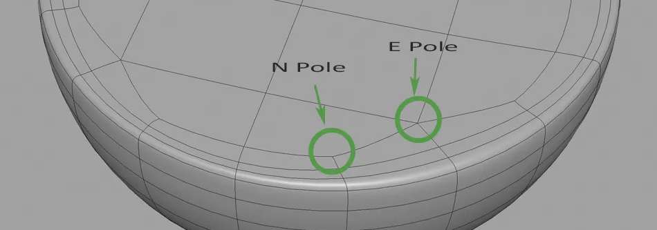

import { Image } from 'astro:assets'

import vrsaki from '../../../../assets/3d-artists-handbook/images/pasted-image-20230608024516.jpg'

import llxecx from '../../../../assets/3d-artists-handbook/images/pasted-image-20230608152633.jpg'

import yhsjqk from '../../../../assets/3d-artists-handbook/images/pasted-image-20230608152651.jpg'

import mvnimf from '../../../../assets/3d-artists-handbook/images/pasted-image-20230608152656.jpg'

import tvgsyj from '../../../../assets/3d-artists-handbook/images/pasted-image-20230608152704.jpg'

import jnkcnp from '../../../../assets/3d-artists-handbook/images/pasted-image-20230608152711.jpg'

import hvcwyc from '../../../../assets/3d-artists-handbook/images/pasted-image-20230608152717.jpg'

import uzsubv from '../../../../assets/3d-artists-handbook/images/pasted-image-20230608152725.jpg'

import oyghrk from '../../../../assets/3d-artists-handbook/images/pasted-image-20230608152733.jpg'

import bmdnsa from '../../../../assets/3d-artists-handbook/images/pasted-image-20230608152740.jpg'

import kyvvsr from '../../../../assets/3d-artists-handbook/images/pasted-image-20230608152745.jpg'

import zqukdu from '../../../../assets/3d-artists-handbook/images/pasted-image-20230608152753.jpg'

import jshozv from '../../../../assets/3d-artists-handbook/images/pasted-image-20230608152802.jpg'

import gmnycp from '../../../../assets/3d-artists-handbook/images/pasted-image-20230608152809.jpg'

import lusctn from '../../../../assets/3d-artists-handbook/images/pasted-image-20230608152816.jpg'

import hbldyd from '../../../../assets/3d-artists-handbook/images/pasted-image-20230608152824.jpg'

import dnvxnz from '../../../../assets/3d-artists-handbook/images/pasted-image-20230608152830.jpg'

import poqdii from '../../../../assets/3d-artists-handbook/images/pasted-image-20230608152839.jpg'

import nmgpxt from '../../../../assets/3d-artists-handbook/images/pasted-image-20230608152846.jpg'

import bcuszn from '../../../../assets/3d-artists-handbook/images/pasted-image-20230608152852.jpg'

import nwcetn from '../../../../assets/3d-artists-handbook/images/pasted-image-20230608152923.jpg'

import rayvbl from '../../../../assets/3d-artists-handbook/images/pasted-image-20230608152320.jpg'

import nsojyp from '../../../../assets/3d-artists-handbook/images/pasted-image-20230608152457.jpg'

import ozaslz from '../../../../assets/3d-artists-handbook/images/pasted-image-20230608152513.jpg'

import ndhrdr from '../../../../assets/3d-artists-handbook/images/pasted-image-20230608152521.jpg'

import shoqet from '../../../../assets/3d-artists-handbook/images/pasted-image-20230608152528.jpg'

import zkpxrx from '../../../../assets/3d-artists-handbook/images/pasted-image-20230608152534.jpg'

import bdsgkf from '../../../../assets/3d-artists-handbook/images/pasted-image-20230608152540.jpg'

import qwwalz from '../../../../assets/3d-artists-handbook/images/pasted-image-20230608152546.jpg'

import xwiwnr from '../../../../assets/3d-artists-handbook/images/pasted-image-20230608024451.png'

import lgattw from '../../../../assets/3d-artists-handbook/images/pasted-image-20230608024436.png'

import wcudpj from '../../../../assets/3d-artists-handbook/images/pasted-image-20230608024420.png'

import hoqkqb from '../../../../assets/3d-artists-handbook/images/pasted-image-20230608024406.png'

import szrpen from '../../../../assets/3d-artists-handbook/images/pasted-image-20230608024347.png'

import scatic from '../../../../assets/3d-artists-handbook/images/pasted-image-20230608024334.png'

import dcmdog from '../../../../assets/3d-artists-handbook/images/pasted-image-20230608024320.png'

import chwhuy from '../../../../assets/3d-artists-handbook/images/pasted-image-20230608024220.png'

[Glossary Topology Terms](/3d-artists-handbook/theory/glossary#topology)

:::tip[Topology resources (videos, articles)]

**Everything you need to know about topology**

<iframe width="560" height="315" src="https://www.youtube-nocookie.com/embed/6Kt0gW3_kio" title="YouTube video player" frameborder="0" allow="accelerometer; autoplay; clipboard-write; encrypted-media; gyroscope; picture-in-picture; web-share" allowfullscreen></iframe>

**Top 5 Topology Mistakes to Avoid**

<iframe width="560" height="315" src="https://www.youtube-nocookie.com/embed/wRPtxydqDuE?si=YccmpYMv6V5DWVdb" title="YouTube video player" frameborder="0" allow="accelerometer; autoplay; clipboard-write; encrypted-media; gyroscope; picture-in-picture; web-share" allowfullscreen></iframe>

**Articles:**

* [https://topologyguides.com/](https://topologyguides.com/)

:::

## Topology Types

The approach to topology varies significantly based on its intended use case. For example, in the **game industry**, performance is key while the **film industry** cares less about that and more so needs high detail for close up shots.

### For Real-Time Use (Game Industry)

First, there's the high-res mesh. This mesh has to play nice with SubDiv, bevels and other modifiers that the mesh needs to utilize. It's only used for baking and as a base for the retopology of the low res mesh. Then there's the low res mesh, the low res mesh is the game ready topology and needs to be optimized, and doesn't have to work with modifiers (SubDiv, bevels).

### For Pre-Rendered Content (Film Industry)

The most commonly used workflow in the film industry, is the subdivision workflow, where the topology is done in such a way to nicely work with and be controlled by subdivisions. This can save a lot of time by removing the need for creating a low mesh for baking, because the low and high can share the same mesh but with different subdivision levels. This means, if one requires really close up shots, one can simply bump up the subdivision level and then after the shot set it back down to something more reasonable.

*(Because of this, game studios will often create a subdivision friendly mesh in addition to their in-game mesh, so they can better make cinematic videos with them.)*

Reusing the high as the low won't always work. If the model was sculpted and not poly modeled, then one will either have to create a new clean mesh by hand or use tools like ZRemesher. The topology will also have to be redone if the object requires soft body deformation.

Some examples of **professional film industry** topology: <Image src={vrsaki} alt="" width="1000" height="auto" />
*topology by [Andrew Hodgson](https://www.artstation.com/andrewhodgson/blog)*

:::tip[Examples (by [Andrew Hodgson](https://www.artstation.com/andrewhodgson/blog))

<Image src={llxecx} alt="" width="1300" height="auto" /> <Image src={yhsjqk} alt="" width="1300" height="auto" /> <Image src={mvnimf} alt="" width="1300" height="auto" /> <Image src={tvgsyj} alt="" width="1300" height="auto" /> <Image src={jnkcnp} alt="" width="1300" height="auto" /> <Image src={hvcwyc} alt="" width="1300" height="auto" /> <Image src={uzsubv} alt="" width="1300" height="auto" /> <Image src={oyghrk} alt="" width="1300" height="auto" /> <Image src={bmdnsa} alt="" width="1300" height="auto" /> <Image src={kyvvsr} alt="" width="1300" height="auto" /> <Image src={zqukdu} alt="" width="1300" height="auto" /> <Image src={jshozv} alt="" width="1300" height="auto" /> <Image src={gmnycp} alt="" width="1300" height="auto" /> <Image src={lusctn} alt="" width="1300" height="auto" /> <Image src={hbldyd} alt="" width="1300" height="auto" /> <Image src={dnvxnz} alt="" width="1300" height="auto" /> <Image src={poqdii} alt="" width="1300" height="auto" /> <Image src={nmgpxt} alt="" width="1300" height="auto" /> <Image src={bcuszn} alt="" width="1300" height="auto" /> <Image src={nwcetn} alt="" width="1300" height="auto" />

:::

:::tip[Production ready vs. concept topology (by [Andrew Hodgson](https://www.artstation.com/andrewhodgson/blog))

<Image src={rayvbl} alt="" width="1300" height="auto" /> <Image src={nsojyp} alt="" width="1300" height="auto" /> <Image src={ozaslz} alt="" width="1300" height="auto" /> <Image src={ndhrdr} alt="" width="1300" height="auto" /> <Image src={shoqet} alt="" width="1300" height="auto" /> <Image src={zkpxrx} alt="" width="1300" height="auto" /> <Image src={bdsgkf} alt="" width="1300" height="auto" /> <Image src={qwwalz} alt="" width="1300" height="auto" />

:::

## Poles

A **pole**, also referred to as **stars**, is a set of edges that merge into a single vertex. There are two types of **poles**: **N-Poles** (3 edges) and **E-Poles** (5+ edges).

Poles with 6 or more edges on curved surfaces will create problems when animating, as well as make shading look bad, especially when using SubDiv modifiers.

It's not always possible to avoid **poles**, but one should strive to have as little poles as possible with the least amount of edges connection together and optimally place / relocate them to an area where they are less visible. **3/5** edge **poles** should appear sparingly and **6+** edge **poles** should ideally never appear, except for on flat surfaces that won't experience any soft body deformations.

### Where Do Poles Commonly Happen?

* (**E-Pole**) Extrusions
* (**E-Pole**) Using triangles and Ngons (it's possible to integrate them without creating poles)
* (**N-Pole**) Inseting faces
* (**N-Pole**) Edges of objects (a cube for example has 8 **N-Poles**)

Blender's selection tools make finding **poles** very easy. Simply select a vertex that isn't a **pole**, then open the **Select Similar** menu (Shift + G) and select **Amount of Connecting Edges**. *(If your software doesn't support these selections tools, then one can add a SubDiv modifier and turn on modifier wireframe, which will make the **E-Poles** very apparent).*

### Placing & Relocating Poles

One can remove **poles** by redoing the topology in that area, however often **poles** are needed and can then be relocated.

Good spots for placing / relocating poles to, are hidden areas, like under the armpit, between the legs and so on. And as mentioned before, the surface should ideally not be very curved. It's also important to move poles away from areas which will experience heavy deformation. Instead of dealing with poles when they're a problem, it's good to anticipate them and plan their locations. It's relatively easy to judge where poles happen by looking at where the mayor topology flows intersect each other.

Here, the **poles** are completely sidestepped by inserting the face before extruding: <video class="sl-obs-embed-video" controls src="/3d-artists-handbook/images/image-2024-01-12-15-42-49.mp4"></video>

Relocating **poles**:

<Image src={xwiwnr} alt="" width="850" height="auto" /> <Image src={lgattw} alt="" width="850" height="auto" />

## Terminating & Rerouting Edge Loops

Terminating edge loops is important when doing the final retopologized version of a mesh. There are 2 patterns to achieve this. These patterns can either be used to decrease or increase loops, as well as for rerouting loops.

**The first pattern is:**

<Image src={wcudpj} alt="" width="750" height="auto" />

**And the second pattern (diamond reroute):**

<Image src={hoqkqb} alt="" width="250" height="auto" />

Edge rerouting should be avoided on curved surfaces. Although rerouting patterns don't play especially nice on highs with SubDivs, they can occasionally be useful in SubDiv control workflows.

## The Optimal Triangle & Quad Shape

* The most optimal triangle shape for a render engine, is a triangle with all of its sides having the same edge length, this is referred to as an equilateral triangle.
* The most optimal quad shape is a quad with all of its sides having the same edge length, this is referred to as a square quad

So with that in mind, in theory the cap topology on the right in *picture 1* is better (it also has 2 fewer triangles). However, the difference doesn't really matter that much, and the latter topology takes more time to make.

<Image src={szrpen} alt="" width="750" height="auto" />
*Picture 1*

For the high cylinder, the most optimal cap would look something like *picture 2* *(Blender grid fill operation)*.

<Image src={scatic} alt="" width="400" height="auto" />
*Picture 2*

As one can nicely see in *picture 3*, the example from *picture 2* has the best result with SubDiv and quite a good result with bevels. The left approach is the best with bevels, but the difference to the right one is negligible.

<Image src={dcmdog} alt="" width="750" height="auto" />
*Picture 3*

## 🚧Work in Progress🚧

* Avoid holding edges, go with creases and bevels
* Evenly space edge loops and try to keep every quad the same size
* Use extra edge loops in areas of heavy deformation. For example, transition areas and muscle joints
* denser topology around movement areas
* Add density in key areas and terminate the edge loop when it leaves that are to reduce polygons but still benefit from dense deformation areas
* Align edge loops with axis animation in mind, the axis of animation is mostly also the direction of the muscles. Though this is good practice, triangulation makes this much less important

Example:

<Image src={chwhuy} alt="" width="600" height="auto" />

* Tris aren't always bad. It's more that tris often bring poles with them which is undesired

#### Topology Methods

These methods are great for the low object, but one should be careful of using them for the high because SubDiv often doesn't play well with topology that isn't nicely quaded with 4 edge poles. And anyway this is to reduce topology count and that doesn't really matter for the high.

#### Retopology

#### ZRemesher Retopo

Use ZRemesher during the creation process or for sculpts that are simply for training, but not for the final retopology pass for characters.

There are 2 methods of getting proper results with ZRemesher. Method 1 is to use the `ZRemesherGuides` tool and method 2 is to use polypaint.

##### ZRemesherGuides Method (Method1):

##### Polypaint Method (Method2):

[Video on this method](https://www.youtube.com/watch?v=9kSaJ1b4QZU)

1. Polypaint the lines you want ZRemesh to follow (It's good to turn off Tablet RGB Intensity)
2. `PolyGroupIt from Paint` with PolyGroupIt Plugin in the ZPlugin tab (default plugin)
   3.(optional) Tessimate SubTool for ZRemesh to go faster
3. ZRemesh with `KeepGroups` on

To-Do

* Loops / Topology Of Characters
* Loops / Topology Of the Face
* Loops / Topology Of The Body
* Loops / Topology Of The Hands
* Loops / Topology Of The Feet

#### Links / Resources

[https://www.youtube.com/watch?v=1DEx3iwFjbk](https://www.youtube.com/watch?v=1DEx3iwFjbk)
[https://www.youtube.com/watch?v=gLIKFCFxnIM](https://www.youtube.com/watch?v=gLIKFCFxnIM)
[https://www.youtube.com/watch?v=gKoNLMRR8iE](https://www.youtube.com/watch?v=gKoNLMRR8iE)
