import { Image } from 'astro:assets'

import ykkqak from '../../../../assets/notes/images/pasted-image-20230608023749.png'

## Overview

This page covers all possible ways to achieve modeling and sculpting tasks. There's no reason to only stick to Blender, ZBrush, Maya, Plasticity or any other 3D software, thanks to bridge tools like GoB / GoZ, which allow for instantaneous transfer of the entire model or only selected parts of the model between different software.

Grouping the features of different software side by side, should also make it very to pick up the other software if one is already familiar with one of them.

Blender, ZBrush and Maya are covered here. Other software like Plasticity, Marvelous Designer, 3D Coat and more, will maybe also be added at some point.

***

Even though a lot is possible in Blender and Maya, one should still try to stick to ZBrush for the bulk of the high detail mesh work because it's faster and allows for more creativity. But it really depends on the type of model one is working on.

My workflow between ZBrush and Blender can be found [here](/notes/model-creation/workflow-between-zbrush-and-blender).

**Software Indicators:**

* 🟠 for Blender actions
* ⚪ for ZBrush actions
* 🔵 for Maya actions
* 🟣 for Plasticity actions
* `Blocks` indicate hotkeys
* *Italics* indicate menu paths & menu items

To prevent learning and building bad muscle memory, only viable methods and good practices will be shown to achieve a specific action. In addition, menu location won't be listed if those actions have hotkeys, which should help keep things more digestible. Although at first all the hotkeys might seem overwhelming, one quickly with frequent use, gets accustomed to them, and eventually they'll majorly speed up ones working speed.

**Remapping Keys?** 
One should try to keep hotkey remapping to a minimum, and only remap things that are necessary because of one's hardware setup for example. The reason for that, is that when using complex software like these, it's good to be as close to stock as possible. This allows one to immediately work on any machine without having to set up everything first and when software evolves over the years, it often changes how workflows and features work, adding removing and changing hotkeys, in which case managing ones own custom hotkeys can be a pain, especially when using lots of 3D software.

Lastly, as this page is quite long, make use of the table of contents on the right (pull window bigger if it's not visible).

***

## Menus & UI

:::tip[🟠 Situationally dependent hotkey helper]

Blender will always show possible hotkeys to follow up with at the bottom. This can be especially helpful when using feature rich tools from add-ons like Hard ops or Boxcutter.

:::

:::tip[⚪ Dealing with ZBrush's badly designed UX]

The PC version of ZBrush in its current state is very clunky and unwieldy when it comes to UI navigation, which is especially problematic in ZBrush, as it's not a hotkey centric software like Blender. To circumvent this issue one should create a custom menu, with sub palettes, nicely sorting all the actions one often needs by thematic into that custom menu. Then one can bind that menu to a hotkey and assign that same hotkey to one of the pen buttons, to easily open this all-in one menu at any time.

*(The tablet version of ZBrush thankfully has a much cleaner UI.)*

<iframe width="560" height="315" src="https://www.youtube-nocookie.com/embed/1F1OyohRiNs?si=ZA511HUm15XIPfsT" title="YouTube video player" frameborder="0" allow="accelerometer; autoplay; clipboard-write; encrypted-media; gyroscope; picture-in-picture; web-share" referrerpolicy="strict-origin-when-cross-origin" allowfullscreen></iframe>

:::

|              Software              | Menus                                                                                                                                                                                                                                                                                                                                                                                                                                                                                                                                                                                                                                                                                                                                                                                                                                                                                                                                                                                                                                                              |
| :--------------------------------: | :----------------------------------------------------------------------------------------------------------------------------------------------------------------------------------------------------------------------------------------------------------------------------------------------------------------------------------------------------------------------------------------------------------------------------------------------------------------------------------------------------------------------------------------------------------------------------------------------------------------------------------------------------------------------------------------------------------------------------------------------------------------------------------------------------------------------------------------------------------------------------------------------------------------------------------------------------------------------------------------------------------------------------------------------------------------- |
|           **UI Hotkeys**           | 🔵 **Full Screen Mode** (`Ctrl` + `Space`) 🟠 **Maximize View** (`Ctr` + `Alt` + `Space`) 🟠 **Maximize View But Keep UI** (`Ctrl` + `Space`) 🟠 **Quad View** (`Ctrl` + `Alt` + `Q`) 🟠 **Open Documentation** (`F1`) Opens the Blender documentation for the selected item. ⚪ **Maximize Viewport** (`Tab`) To hide the Tool menu on the right double-click the divider beside it. ⚪ **UI Magnifier** (`Shift` + `M`) ⚪ **Show Item Tooltip** (`Ctrl-hold`) ⚪ **Expand Multiple Drop-Downs at Once** (`Shift` + `LMB` *on menu name*)                                                                                                                                                                                                                                                                                                                                                                                                                                                                                                    |
|         **Maya - General**         | 🔵 **Search Menu** (`Ctr` + `F`) Allows for searching of menus, tools, commands and objects. 🔵 **Hotbox** (`Space`) 🔵 **Perspective Menu** (`Space` *> Maya* + `RMB`) 🔵 **Marking Menus** (`RMB` / `Ctrl` + `RMB` / `Shift` + `RMB` / `Ctrl` + `Shift` + `RMB`) Marking menus dynamically adapt based on what is selected and in what mode one is in. [Maya doc](https://help.autodesk.com/view/MAYAUL/2024/ENU/?guid=GUID-8BA1A3AA-4C44-4779-8B22-0AAE3627E8EB), [video on marking menus](https://www.youtube.com/watch?v=j15MLgnIKfI)                                                                                                                                                                                                                                                                                                                                                                                                                                                                                                             |
|      **Maya - Marking Menus**      | ℹ️ Maya's marking menus have the potential for incredible speed if one can remember the flick directions. One can even pre flick before the menu has appeared.  🔵 **Polygon & NURBS Marking Menu** (`Ctrl` + `RMB` *with object selected*) 🔵 **Convert Selection Marking Menu** (`Ctrl` + `RMB` *with object selected*) 🔵 **Polygon Tools Marking Menu** (`Shift` + `RMB` *with object selected*) 🔵 **Create Polygon Marking Menu** (`Shift` + `RMB` *without a selection*) 🔵 **UV Marking Menu** (`Shift` + `RMB` *in UV selection mode*) 🔵 **UV Shell Marking Menu** (`Shift` + `RMB` *in UV Shell selection mode*) 🔵 **Transform Marking Menu** (`Ctrl` + `Shift` + `RMB`) Menu depends on active selection and transform mode. 🔵 **Input & Output Marking Menu** (`A` + `RMB` *with or without selection*) 🔵 **NURBS curves Marking Menu** (`Shift` + `RMB` on NURBS) 🔵 **Blue Pencil Marking Menu** (`RMB` *with Blue Pencil Tool active*) 🔵 **Sculpting Marking Menu** (`Shift` + `RMB` *in Sculpting space*) |
|        **Blender - General**       | 🟠 **Search** (`Space` or `F3` *(version dependent)*) Every pop-up window and every action can be found here. This is especially helpful to search for functionality from add-ons.  🟠 **Quick Favorite Menu** (`MB4`) The default mapping is `Q`, but Hard Ops already uses that key. 🟠 **Toggle Toolbar** (`T`) I like to keep it hidden. 🟠 **Toggle Sidebar** (`N`)                                                                                                                                                                                                                                                                                                                                                                                                                                                                                                                                                                                                                                                                                  |
|  **Blender - Object & Edit Mode**  | 🟠 **Mode Pie Menu** (`Ctrl` + `Tab`) Flicking mouse works. [Doc](https://docs.blender.org/manual/en/latest/interface/controls/buttons/menus.html#pie-menus) 🟠 **Object Context & Action Menu** (`RMB`) 🟠 **Add Object Menu** (`Shift` + `A`) 🟠 **Cursor Pie Menu** (`Shift` + `S`) 🟠 **Origin Pie Menu** (`Ctrl` + `Alt` + `X`) Requires 3D Viewport Pie menu add-on which is bundled with Blender. One can uncheck all except for origin pie menu in the add-on settings.                                                                                                                                                                                                                                                                                                                                                                                                                                                                                                                                                                        |
| **Blender - Object Mode Specific** | 🟠 **Apply Menu** (`Ctrl` + `A`) 🟠 **Parent Menu** (`Ctrl` + `P`) There's also vertex parent in edit mode. 🟠 **Clear Parent Menu** (`Alt` + `P`) 🟠 **Keyframe Item** (`I`) Directly keyframes the selected item. One can keyframe almost anything in Blender, both in the viewport and in the UI. If an item can't be keyframed with `I`, then right click it or click the little diamond beside the field. Keyframed fields are highlighted yellow. 🟠 **Keframe Menu** (`K` *(`I` in pre Blender 4.1)*) 🟠 **Link & Transfer Data Menu** (`Ctrl` + `L`) 🟠 **Move to Collection Menu** (`M`) 🟠 **Select Grouped Menu** (`Shift` + `G`)                                                                                                                                                                                                                                                                                                                                                                                                  |
|  **Blender - Edit Mode Specific**  | 🟠 **Extrude Menu** (`Alt` + `E`) 🟠 **Normals Menu** (`Alt` + `N`) 🟠 **UV Menu** (`U`) 🟠 **Separate Menu** (`P`) 🟠 **Merge Menu** (`M`) 🟠 **Select Similar** (`Shift` + `G`) 🟠 **Vertices Menu** (`Ctrl` + `V`) 🟠 **Edge Menu** (`Ctrl` + `E`) 🟠 **Faces Menu** (`Ctrl` + `F`) 🟠 **Hook Menu** (`Ctrl` + `H`)                                                                                                                                                                                                                                                                                                                                                                                                                                                                                                                                                                                                                                                                                                                  |
|        **ZBrush - General**        | ⚪ **Quick Menu** (`Space`) ⚪ **Brush Menu** (`B`) ⚪ **Lightbox** (`,`) ⚪ **Tool Menu** (`F1` / `M`) ⚪ **Stroke Menu** (`F3`) ⚪ **Alpha Menu** (`F4`) ⚪ **Texture Menu** (`F5`) ⚪ **Open Lightbox Image With Associated Image Viewer** (`Alt` + `LMB` + `LMB`) Will open .psd files in photoshop, so one can directly edit and save them. One can also in the Windows settings define what file formats are associated with which software. ⚪ **Clear Canvas** (`Ctrl` + `N`) ⚪ **View Topology & Polygroups** (`Shift` + `F`)                                                                                                                                                                                                                                                                                                                                                                                                                                                                                                           |

## Viewport Navigation

Navigation hotkeys are some of the only hotkeys I think are worth remapping based on personal hardware setup and preference. *Note that some of the Blender hotkeys here are remapped.*

|                      Functionality                     | Hotkeys & Notes                                                                                                                                                                                                                                                                                                   |
| :----------------------------------------------------: | :---------------------------------------------------------------------------------------------------------------------------------------------------------------------------------------------------------------------------------------------------------------------------------------------------------------- |
|                     **Rotate View**                    | 🟠 **Orbit** (`MMB`) 🟠 **Snap Rotate** (`Alt` + `MMB`) 🔵 **Tumble** (`Alt` + `LMB`) 🔵 **Axis Limited Tumble** (`Alt` + `LMB` + `Shift`) ⚪ **Rotate** (`RMB-drag`) ⚪ **Snap Rotate** (`RMB-drag` + `Shift`)                                                                                      |
|                      **Pan View**                      | 🟠 **Pan** (`Shift` + `MMB`) 🔵 **Track** (`Alt` + `MMB`) ⚪ **Move** (`Alt` + `RMB`)                                                                                                                                                                                                                        |
|                      **Zoom View**                     | 🟠 **Zoom** (`Scroll` or `Ctrl` + `MMB`) 🔵 **Dolly** (`Scroll` or `Alt` + `RMB` or `Ctrl` + `Alt` + `RMB`) ⚪ **Scale** (`Ctrl` + `RMB-drag` or `+` / `-`)                                                                                                                                                  |
|                   **Frame Selected**                   | 🟠 **Frame Selected**. Requires numpad, so map it to a key, or add it to the quick favorites. 🔵 **Frame Selected** (`F`) ⚪ **Frame Active** (`F`)                                                                                                                                                          |
|                      **Frame All**                     | 🟠 **Frame All** (*View > ...*) Requires numpad, so map it to a key, or add it to the quick favorites. 🔵 **Frame All** (`A`) ⚪ **Center SubTool** (`F`)                                                                                                                                                    |
| **View Front, Back, Right, Left, Top, Bottom & Other** | 🟠 **Front & Back** (`1` / `Ctrl` + `1`) 🟠 **Right & Left** (`2` / `Ctrl` + `2`) 🟠 **Top & Bottom** (`3` / `Ctrl` + `3`) 🟠 **Orbit 180°** (`9`) 🔵 **Front & Back** (`Space` > *Maya* + `LMB`) 🔵 **Right & Left** (`Space` > *Maya* + `LMB`) 🔵 **Top & Bottom** (`Space` > *Maya* + `LMB`) |

Although it's not re recommended, it's possible to give Blender a first person like navigation like in Unreal Engine. Simply assign a hotkey to *Walk/Fly* (*Preferences > Keymap > ...*), and customize its options. (*Preferences > Navigation > Fly & Walk*). Fly mode is good for working on the project, while walk mode can be very interesting for looking at environments. (View height, jump height and gravity force can all be adjusted.)

The reason why first person navigation like that is better suited for game engines, is because there one mostly places objects into a world, where the normal navigation system wouldn't work especially well. But in modeling software where one is mostly working on one object or character at a time, it's a lot more useful to be able to orbit around the object.

:::note[Blender has some more very niche and situational navigation actions]

|     Method     | Notes           |
| :------------: | :-------------- |
|    Orbit Up    | 🟠 `4`          |
|   Orbit Down   | 🟠 `5`          |
|   Orbit Left   | 🟠 `6`          |
|   Orbit Right  | 🟠 `7`          |
|   Pan View Up  | 🟠 `Ctrl` + `4` |
|  Pan View Down | 🟠 `Ctrl` + `5` |
|  Pan View Left | 🟠 `Ctrl` + `6` |
| Pan View Right | 🟠 `Ctrl` + `7` |

:::

## Adding & Editing Shapes

|       Functionality       | Hotkeys & Notes                                                                                                                                                                                                                                                                                                                                                                                                                                                                                                                                |
| :-----------------------: | :--------------------------------------------------------------------------------------------------------------------------------------------------------------------------------------------------------------------------------------------------------------------------------------------------------------------------------------------------------------------------------------------------------------------------------------------------------------------------------------------------------------------------------------------- |
|  **Add Primitive Shape**s | 🟠 **Add** (`Ctrl` + `A`) 🔵 **Create Polygon Primitives** (`Shift` + `RMB` or *Poly Modeling shelf*) ⚪ **Append & Inset** (*Tool > SubTool > ...*) ⚪ **Insert Brushes** (`B`) A quick way to add basic shapes and even entire models directly onto a SubTool's surface. Works great with mesh fusion.                                                                                                                                                                                                                                |
| **Edit Primitive Shapes** | 🔵 **Show Manipulator Tool** (`T`) Works as long as no components (vertex, edge, face) are modified. 🔵 When creating primitive shapes, click the box left of the shape's name to open the shape's settings. 🟠 Use *Add* Pop-up menu at the bottom left. Works until menu is gone. ⚪ *ToDo*                                                                                                                                                                                                                                          |
|      **Draw Shapes**      | ⚪ **Mesh Balloon** (`Ctrl` *> ...*) [Showcase](https://youtu.be/alOxwGecqx8?si=52gL75WqdCSsa9ah). `Ctrl` + `LMB` to add new balloon. While view hasn't moved one can cut away parts with `Ctrl` + `Alt` + `LMB` or add to it with `Ctrl` + `LMB` followed by `Shift` when shape is done. If *Live Boolean* is on, `Ctrl` + `Alt` + `LMB` will instead create a new SubTool and enable *Subtract* on it, while `Ctrl` + `LMB` followed by `Shift` will keep the boolean mode set to *Add*. Finally clean up and merge with ZRemesh or DynaMesh. |

## Transforming

When speed modeling, using gizmos for transforming objects is terribly slow and imprecise, if the software allows for transforming with hotkeys like Blender, always use that instead.

|         Functionality        | Hotkeys & Notes                                                                                                                                                                                                                                                                                                                                                                                                                                                                                                                                                                                                                                                                                                                                                                                                                                                                                                                                                                                                                                                                                                                                                                                                                                                                                                                                                                                                                                                                                                                                                                                                                                                                                                                                                                                                                                                   |
| :--------------------------: | :---------------------------------------------------------------------------------------------------------------------------------------------------------------------------------------------------------------------------------------------------------------------------------------------------------------------------------------------------------------------------------------------------------------------------------------------------------------------------------------------------------------------------------------------------------------------------------------------------------------------------------------------------------------------------------------------------------------------------------------------------------------------------------------------------------------------------------------------------------------------------------------------------------------------------------------------------------------------------------------------------------------------------------------------------------------------------------------------------------------------------------------------------------------------------------------------------------------------------------------------------------------------------------------------------------------------------------------------------------------------------------------------------------------------------------------------------------------------------------------------------------------------------------------------------------------------------------------------------------------------------------------------------------------------------------------------------------------------------------------------------------------------------------------------------------------------------------------------------------------- |
|        **Transforms**        | 🟠 **Move, Rotate & Scale** (`G` / `R` / `S`) Use `Shift` and `Ctrl` for slow and snap. Tools like magnet can also be toggled mid-action with `Shift` + `Tab`. Pressing `X` / `Y` / `Z` after the transform action, will limit the action to that axis, while holding `Shift` with that axis key will exclude that axis. Values like rotation degrees can be typed directly into the viewport. Common rotations are: 45°, 90°, 135°, 180°, for anything above 180° use minus values to rotate in the opposite direction: -45°, -90°, ... . 🟠 **Trackball Rotate** (`R` + `R`) A fun alternative way of rotating, which works surprisingly well.  ⚪ **Transpose Gizmo** (`W`) The Gizmos's center acts as a temporary pivot point for it's actions. Holding `Alt` allows moving of the Gizmo itself. Holding `Shift` rotates in 5° increments. There are a couple of buttons above the Gizmo: 🔄️ will reset SubTool and Gizmo rotations, while `Alt` + 🔄️ will only reset the Gizmo rotation. 🏠 will set the Gizmo to the World Center (0, 0, 0) moving the SubTool with it, while `Alt` + 🏠 will only set the Gizmo to the World Center.📍 will set the Gizmo to the meshes center of mass, masking will influence this (make sure to have *Activate Symmetry* disabled, for this to work).  The checklist button allows for transposing multiple SubTools at once. Use ZBrush's selection tool hotkeys to modify the selection.  If the Gizmo is acting strangely, it may be because of focal shift.  ⚪ **Transpose Line** (`W` + `Y`) Advanced legacy transpose tool ([a transpose line trick](https://youtu.be/epWVQJN3ZEQ))  🔵 **Move, Rotate & Scale Tool** (`W` / `E` / `R`) Hotkey activated but gizmo based. Change gizmo size with `+` / `-`. Gizmo also indicates, with gray lines, what the original state was. |
| **Set Mesh on World Center** | ⚪ **Snap to Ground macro** (`Macro > Macros > Snap to Ground`)                                                                                                                                                                                                                                                                                                                                                                                                                                                                                                                                                                                                                                                                                                                                                                                                                                                                                                                                                                                                                                                                                                                                                                                                                                                                                                                                                                                                                                                                                                                                                                                                                                                                                                                                                                                                    |
|  **Slide Vertices & Edges**  | 🟠 **Vertex & Edge Slide** (`G` + `G`) `E` toggles even. `F` flips the even. `Alt` or `C` toggles clamping. `A` adds a snap point, but needs snapping to be enabled. 🔵**Slide Edge Tool** (`Shift` + `RMB` *> ...*) `MMB` to slide. `Shift` to scale. [B Doc](https://docs.blender.org/manual/en/latest/modeling/meshes/editing/edge/edge_slide.html)                                                                                                                                                                                                                                                                                                                                                                                                                                                                                                                                                                                                                                                                                                                                                                                                                                                                                                                                                                                                                                                                                                                                                                                                                                                                                                                                                                                                                                                                                                      |

⚪ **Transpose Line**
Video on Transpose line [here](https://www.youtube.com/watch?v=FVaTCf90l7Q).

Click the Gizmo button, to switch between the Transpose Line and Gizmo. (*Transform > Gizmo Button*)

* Click hold to stick to surface
* Outer circles to position transpose
* Inner circles to modify object (shift works)
* `Ctrl` + `LMB` on white circle, to make view align to line

## Origin & Pivot Points

|                    Functionality                   | Hotkeys & Notes                                                                                                                                                                                                                                                                                                                                                                                                                                                                                                                                                                                                                                                                                                                                                                                                                                                                                                                                                                                                                     |
| :------------------------------------------------: | :---------------------------------------------------------------------------------------------------------------------------------------------------------------------------------------------------------------------------------------------------------------------------------------------------------------------------------------------------------------------------------------------------------------------------------------------------------------------------------------------------------------------------------------------------------------------------------------------------------------------------------------------------------------------------------------------------------------------------------------------------------------------------------------------------------------------------------------------------------------------------------------------------------------------------------------------------------------------------------------------------------------------------------- |
|                         🟠                         | 🟠                                                                                                                                                                                                                                                                                                                                                                                                                                                                                                                                                                                                                                                                                                                                                                                                                                                                                                                                                                                                                                  |
|                  **World Origin**                  | 🟠 It's an unmovable point visible when turning on the *Axes* (*Viewport Overlays > ...*) or by settings the 3D Cursor back to the World Origin (`Shift` + `S`). (Sadly, Blender currently has no way of using the World Origin in modifier fields, so a workaround is to add a hidden and disabled empty called "World Origin".)                                                                                                                                                                                                                                                                                                                                                                                                                                                                                                                                                                                                                                                                                                   |
|                    **3D Cursor**                   | 🟠 Per default the 3D Cursor sits at the World Origin. Objects added to the scene will be placed at the 3D Cursor. The 3D cursor can be moved around with `Shift` + `RMB` and can be reset to the World Origin with the `Shift` + `C`. The `Shift` + `S` menu allows for objects to be moved to the 3D Cursor or the 3D Cursor to be moved to the origin of those objects.  (*Viewport Overlays > 3D Cursor (white red circle)*)                                                                                                                                                                                                                                                                                                                                                                                                                                                                                                                                                                                              |
|                  **Object Origin**                 | 🟠 Every object has their own origin point, which stores each object's location, rotation and scale. The origins transform values can be seen under the *Sidebar's Item* tab (`N`).  Moving, rotating and scaling the object in object mode will modify the origin's transform values, while moving the object in edit mode, only moves the polygons away from the origin, keeping the origin untouched. Other options for modifying the object's origin transform values are editing them in the aforementioned *Sidebar Item* tab or under *Object > Set Origin*. Lastly the origin's transforms can be reset with the *Apply* menu (`Ctrl` + `A`).  (*Viewport Overlays > Origins (orange dot)*)                                                                                                                                                                                                                                                                                                                     |
| **Transform Orientations & Transform Pivot Point** | 🟠 These two menus found at the top of the viewport determine how tools behave. It's good to get familiar with all of them until they are second nature, as one will be switching between them very often. By selecting a face and pressing *+* under the *Transform Orientations* dropdown menu, one can create a new rotation guide based on that face's normal direction. This technique is essential during hard surface modeling.                                                                                                                                                                                                                                                                                                                                                                                                                                                                                                                                                                                              |
|                          ⚪                         | ⚪                                                                                                                                                                                                                                                                                                                                                                                                                                                                                                                                                                                                                                                                                                                                                                                                                                                                                                                                                                                                                                   |
|       **Primary Center Point (world center)**      | ⚪ The primary center point which acts like Blender's World Origin, is hard locked to X-0, Y-0, Z-0. Let's call it World Center.  Actions like mirror are based on the World Center, unless *Local Symmetry* (*Transform > L.Sym*) is enabled.  To see it, enable the *Floor* (`Shift` + `P`). Make sure X, Y and Z icons on top of the *Floor* button are, to only see the World Center point (*Draw > Floor*).  One can also simply reset the transform gizmo with the home button.                                                                                                                                                                                                                                                                                                                                                                                                                                                                                                                                    |
|         **Secondary Center Point (floor)**         | ⚪ The secondary center point is the floor, it has the X and Z axes hard locked to 0, but the Y (up) axis can freely move. Let's call it *floor*.  As long as *elv* is set to "-1" (*Draw > Elv*), the floor dynamically repositions to make sure that it's always below the lowest point of the lowest SubTool. When floor *elv* is changed to "0", then the floor has all axis locked to 0, 0, 0 and stops dynamically adjusting, making it basically like the World Center. Dynamic floor ("-1") is great for quickly doing changes like extending the leg length.  Because ZBrush currently has no good way of quickly placing the entire model with all its SubTools on the floor at the World Center (0, 0, 0), one should use dynamic floor.  To see it enable the *Floor* (`Shift` + `P`), more floor options under *Draw > Floor*.                                                                                                                                                                        |
|               **SubTool Pivot Point**              | ⚪ Using the transpose tool will move the SubTool's Pivot Point. If the SubTool and its Pivot Point aren't centered anymore, there are a couple of ways of fixing it:  One can use *Set Pivot Point* (*Transform > S.Pivot*) to temporarily reset the object's pivot point. Pressing *Clear Pivot Point* (*Transform > C.Pivot*) will restore the previous pivot point. *Set Pivot Point* will nicely work if the mesh is symmetrical. On non-symmetrical meshes, one can temporarily isolate a part of the mesh that is symmetrical, allowing *Set Pivot Point* to set a proper point. ([showcase of that here](https://www.youtube.com/watch?v=hqipgkk9lHw))  A permanent way of resetting a SubTool's pivot point, is with *Unify* (*Tool > Deformation*).  As mentioned before, symmetry tools are mostly based on the World Center, except for if *Local Symmetry* (*Transform > L.Sym*) is enabled, in which case the SubTools Pivot Point is used instead.   *ToDo: How to view SubTool pivot point?* |
|                         🔵                         | 🔵                                                                                                                                                                                                                                                                                                                                                                                                                                                                                                                                                                                                                                                                                                                                                                                                                                                                                                                                                                                                                                  |
|           **World Origin (World Space)**           | 🔵 It's an unmovable point visible by enabling the *Grid* (*Display > ...*). Objects added to the scene will be placed at the World Origin.                                                                                                                                                                                                                                                                                                                                                                                                                                                                                                                                                                                                                                                                                                                                                                                                                                                                                         |
|          **Object Origin (Object Space)**          | 🔵 *ToDo*: Every object has their own origin point, which stores each object's location, rotation and scale. The origin transform values can be seen ?*ToDo*?. It can be moved by entering *Edit Pivot* mode (`D`). Although this also works in component mode, it won't be moving the object's actual origin unless it's done in object mode. It's nicely paired with Snap (`V`). (*ToDo*: Look into relation between local and object space, moving the origin / gizmo with `D` changes the values seen under *Modeling Toolkit > Move Settings*, but not the values seen under *Channel Box*) ([maya doc on that](https://help.autodesk.com/view/MAYAUL/2025/ENU/?guid=GUID-A63AC5C8-8822-42AC-827E-164B5266DA03), [video here](https://www.youtube.com/watch?v=kHG_n3hha3I))                                                                                                                                                                                                                                                    |
|          **Local Origin (Local Space)**         | 🔵 *ToDo*                                                                                                                                                                                                                                                                                                                                                                                                                                                                                                                                                                                                                                                                                                                                                                                                                                                                                                                                                                                                                           |

## Selecting

Almost every software uses the `LMB` & `Shift` + `LMB` & `Alt` + `LMB` keys to add and remove from selections. The selection behavior will depend on the currently active selection mode. 🟠In Blender, the modes can be switched above the toolbar, with the options being: Set a new selection, extend existing selection, subtract existing selection, invert existing selection and intersect existing selection (some selection tools aren't able to use all the modes). 🔵 Maya can't switch between selection modes, it can: Add to selection with `Ctrl` + `Shift`, remove from selection with `Ctrl` and invert selection with `Shift`.

🟠 Switching between vertex / edge / face selection mode is done with the  `Ctrl` + `1` / `2` / `3` (with emulated numpad on). 🔵 In Maya one simply pulls the `RMB` and selects the desired mode in the pop-up menu. One can also use hotkeys, which are slower but in some situations needed (Object mode `F8`, Vertex mode `F9`, Edge mode `F10`, Face mode `F11`, UV mode `F12`).

Unlike Blender, Maya remembers selections done in vertex, edge and face mode separately. To transfer a selection done in one mode to another mode use `Ctrl` + `RMB` > *To Faces, ... > To Faces*.

|                       Functionality                      | Hotkeys & Notes                                                                                                                                                                                                                                                                                                                                                                                                                                                                                                                                                                            |
| :------------------------------------------------------: | :----------------------------------------------------------------------------------------------------------------------------------------------------------------------------------------------------------------------------------------------------------------------------------------------------------------------------------------------------------------------------------------------------------------------------------------------------------------------------------------------------------------------------------------------------------------------------------------- |
|            **Switch Objects while Sculpting**            | ⚪ **Switch SubTool** (`Alt` + `RMB`) 🟠 **Switch Objetcs** (`Alt` + `Q`)                                                                                                                                                                                                                                                                                                                                                                                                                                                                                                                |
|                 **Switch Selection Tool**                | 🟠 **Cycle Selection Tools** (`W`) Cycles through: Select Box, Select Circle, Select Lasso and Tweak. 🔵 **Box Select Tool** (`Q`) `Alt` to move selection box. 🔵 **Marquee Select** (`Tab` + `LMB-drag`) Synergizes well with box select. 🔵 **Lasso Select & Paint Select** (*Tool Box Bar*)                                                                                                                                                                                                                                                                                   |
|                      **Select All**                      | 🟠 **Select & Deselect All** (`A` / `A` + `A`) 🔵 **Select & Deselect All** (`Ctrl` + `Shift` + `A` / *Click in Viewport*)                                                                                                                                                                                                                                                                                                                                                                                                                                                              |
|                **Select Linked Geometry**                | 🟠 **Select & Deselect Linked - Under Cursor** (`L` / `Shift` + `L`) 🟠 **Select All Linked** (`Ctrl` + `L`) 🔵 **Select Linked Vertices & Faces** (`RMB` + `RMB`) Add and remove from selection with `Shift` and `Ctrl`. [B doc](https://docs.blender.org/manual/en/latest/modeling/meshes/selecting/linked.html#bpy-ops-mesh-select-linked)                                                                                                                                                                                                                                     |
|                   **Invert Selection**                   | 🟠 **Invert** (`Ctrl` + `I`) 🔵 **Inverse** (`Ctrl` + `Shift` + `I`)                                                                                                                                                                                                                                                                                                                                                                                                                                                                                                                    |
|                **Grow & Shrink Selection**               | 🟠 **Select More & Less** (`Ctrl` + `+` / `Ctrl` + `-`) 🔵 **Grow & Shrink** (`Ctrl` + `Shift` + `I`) 🔵 **Grow & Shrink Along Loop** (`Ctrl` + `Shift` + `<` / `Ctrl` + `<`)                                                                                                                                                                                                                                                                                                                                                                                                        |
|                     **Select Loops**                     | 🟠 **Select Vertex, Edge & Face Loop** (`Alt` + `LMB`) 🟠 **Generate Edge Loops from Selection** (*Select > Select Loops > Edge Loops*) 🔵 **Select Edge Loop** (`LMB` + `LMB`) Doesn't work well around n-gons, in which case contiguous edge selection can be helpful. 🔵 **Select Vertex & Face Loop** (`Shift` + `LMB` + `LMB`) Select a vertex or face directly beside it. 🔵 **Select Contiguous Edges** (`Ctrl` + `RMB` *> To Edges > To Contiguous Edges*)                                                                                                             |
|                     **Select Rings**                     | 🟠 **Select Edge Ring** (`Ctrl` + `Alt` + `LMB`) 🟠 **Generate Edge Rings from Selection** (*Select > Select Loops > Edge Rings*) 🔵 **Select Edge Ring** (`Shift` + `LMB` + `LMB`) Select an edge parallel directly beside it.                                                                                                                                                                                                                                                                                                                                                      |
|             **Select Edges by Angle Degrees**            | 🟠 **Select Sharp Edges** (*Select > ...*) Edit degree threshold in pop-up window. 🔵 **Select Hard Edges Script** ([script link](https://www.playcreative.io/blog/automatic-hard-edge-script-in-maya)) 🔵 **Select By Angle Constraint**. First select entire mesh (`Ctrl` + `Shift` + `A`). Then open *Constraint Selection* menu (*Select > Use Constraints*) and set *Constrain* to *All and Next* and enable *Activate* under *Geometry > Angle*. Finally, one can adjust the *min* and *max* degree threshold values.                                                          |
|               **Advanced Selection Menus**               | 🟠 **Select Menu** (*Select*) 🟠 **Select Similar Menu** (`Shift` + `G`) 🔵 **Select Menu** (*Select*) 🔵 **Selection Constraints Menu** (`Ctrl` + `RMB` *> ...*)                                                                                                                                                                                                                                                                                                                                                                                                                 |
|                    **Soft Selection**                    | 🟠 **Proportional Editing** (`O`) `Scroll` to change radius. Options at top in viewport. 🔵 **Soft Selection** (`B`) `B` + `Scroll` to change radius. Open the options window by double-clicking the selection tool cursor icon.                                                                                                                                                                                                                                                                                                                                                        |
|                   **Selection Groups**                   | 🟠 **Vertex Groups** (*Properties > Data > ...*) 🔵 **Selection Sets** (*Create > Sets > Quick Select Set*) The sets can easily be accessed at ???. Works with components, objects and even stuff like rig controls. One can drag objects from the outliner into sets.                                                                                                                                                                                                                                                                                                                  |
|                **Misc Selection Methods**                | 🔵 **Select By Name** (*Status Line > Input line menu of operations > Select by name*) Use "\*" as prefix and suffix.                                                                                                                                                                                                                                                                                                                                                                                                                                                                      |
| **Front Face Only (Camera based) & Select Through Mesh** | 🟠 **Wireframe Viewport Shading Mode** 🟠 **X-Ray** (`Alt` + `Z`) Hotkey doesn't work in edit mode if one uses the mesh machine add-on. 🟠 **[Border Occlusion](https://github.com/Darcvizer/Border-Occlusion) add-on**. Automatically enables x-ray whenever selecting. 🔵 **Camera-based Selection** (*Windows > General Editors > Tool Settings > Common Selection Options > ...*) 🔵 **Wireframe Mode** (`4`) ⚪ **Transparency & Ghost Transparency** (*Transform > ...*) ⚪ **Backface Mask** (*Brush > Auto Masking > ...*) ⚪ **Draw Polyframe** (`Shift` + `F`) |

Interesting selection methods that can often be found in software's advanced selection menus (or through using add-ons) include:

* Select Random
* Checker Deselect
* Select Edges by Sharpness Angle
* Select Linked Flat Faces
* Select Polygons by Sides / Number of Vertices
* Select by Material
* Select Loose Geometry
* Select Non Manifold
* Select Interior Faces
* Select One Side of the Axis (Select Side of Active)
* Select Mirror

Blender [documentation](https://docs.blender.org/manual/en/latest/modeling/meshes/selecting/index.html) on selecting. 
Maya [documentation](https://help.autodesk.com/view/MAYAUL/2024/ENU/?guid=GUID-730DA883-8B11-4A40-9573-0A54AA1D861F) on selecting.

## Vertex Groups & Polygroups

|          Functionality          | Hotkeys & Notes                                                                                                                                                                                                                                                                                                                                                                                                                              |
| :-----------------------------: | :------------------------------------------------------------------------------------------------------------------------------------------------------------------------------------------------------------------------------------------------------------------------------------------------------------------------------------------------------------------------------------------------------------------------------------------- |
|   **Painting With Polygroups**  | ⚪ ZModeler brush has to be active. `Alt` painting adds a white Polygroup while `Alt` painting over the same spot again restores the previous Polygroup color. To give the newly created white Polygroup it's unique color, one can after painting with `Alt`, continue holding down `LMB` and tap `Alt` to cycle through Polygroup colors. In addition, most ZModeler actions will allow for pressing `Alt` mid-action, to cycle Polygroups. |
|  **Polygroup Visible & Masked** | ⚪ **Group Masked Clear Mask** (`Ctrl` + `W`) To get a perfectly smooth cut between Polygroups, set *Polish Grouped Polygons* to "1" (*Polygroups > ...*).                                                                                                                                                                                                                                                                                    |
|  **Polygroup From Last Stroke** | ⚪ **Group Changed Points** (*Tools > Polygroups > ...*)                                                                                                                                                                                                                                                                                                                                                                                      |
| **Polygroup By Connected Mesh** | ⚪ **Auto Groups** (*Tools > Polygroups > ...*)                                                                                                                                                                                                                                                                                                                                                                                               |
|      **Polygroup By Angle**     | ⚪ **Group By Normals** (*Tools > Polygroups > ...*)                                                                                                                                                                                                                                                                                                                                                                                          |
|  **Further Polygroup Options**  | ⚪ **Polygroup Menu** (*Tools > Polygroups*)                                                                                                                                                                                                                                                                                                                                                                                                  |

*ToDo: Add 🟠 and 🔵 equivalent.*

## Visibility & Masking

Despite its name, ZBrush's selection tools are actually visibility management tools.

|       Functionality       | Hotkeys & Notes                                                                                                                                                                                                                                                                                                                                                                                                                                                                                                                                                                                                                                           |
| :-----------------------: | :-------------------------------------------------------------------------------------------------------------------------------------------------------------------------------------------------------------------------------------------------------------------------------------------------------------------------------------------------------------------------------------------------------------------------------------------------------------------------------------------------------------------------------------------------------------------------------------------------------------------------------------------------------- |
|    **Isolate Selected**   | 🟠 **Local View** (`^`) Only works on objects. 🔵 **Isolate Select** (`Ctrl` + `1`) Works on objects and components. ⚪ **Solo Mode** (*Transform > ...*)                                                                                                                                                                                                                                                                                                                                                                                                                                                                                            |
|          **Hide**         | 🟠 **Hide Selected** (`H`) 🔵 **Hide Selected** (`H`) 🔵 **Hide Un-selected** (`Alt` + `H`) ⚪ **Hide Selected** (`Ctrl` + `Shift` + `ALT` + `LMB-drag`) ⚪ **Hide Everything Except Selected** (`Ctrl` + `Shift` + `LMB-drag`)                                                                                                                                                                                                                                                                                                                                                                                                                 |
|     **Invert Hidden**     | ⚪ **Invert Selection** (`Ctrl` + `Shift` + `LMB-drag` *on canvas*)                                                                                                                                                                                                                                                                                                                                                                                                                                                                                                                                                                                        |
|    **Increase Hidden**    | ⚪ **Grow & Shrink Selection** (`Ctrl` + `Shift` + `S` / `Ctrl` + `Shift` + `X`) ⚪ **Grow Selection By Polygroup** (`Ctrl` + `Shift` + `Q`) Fully reveals all Polygroups that are partially visible. ⚪ **Grow Selection By Connected Mesh** (`Ctrl` + `Shift` + `A`) Reveals all polygons connected to currently visible polygons.                                                                                                                                                                                                                                                                                                                   |
|        **Un-hide**        | 🟠🔵⚪ **Un-hide Selected** (*Press eye icon in outliner*) 🟠 **Show Hidden** (`Alt` + `H`) Never use this in object mode, as it reveals every single hidden object in the file. There are better ways of managing visibility. 🔵 **Show All** (*Display > Show > All*) ⚪ **Un-hide All** (`Ctrl` + `Shift` + `LMB-click` on canvas)                                                                                                                                                                                                                                                                                                              |
|        **Masking**        | 🟠 **Masking Brushes** (*sculpting mode* + `T` or `Shift` + `Space`) ⚪ **Masking Brushes** (`Ctrl-hold `*> press mask brush icon*) `Alt` makes the actively drawn mask subtracts instead of add. `Space-drag` moves masking shape. For *Mask Curve* `Alt` adds bézier curve, while `Alt` + `Alt` adds a sharp curve. `Ctrl` + `RMB` in viewport, inverts mask. `Ctrl` + `RMB-drag` *> In Viewport* removes entire mask. `Ctrl` + `RMB` *> On Model* blurs the mask, while `Ctrl` + `Alt` + `RMB` *> On Model* sharpens the mask. With Transpose Brush (`W`) active, `Ctrl` + `RMB-drag` on the mesh, to fill it with a mask from a specific direction. |
| **Advanced Masking Menu** | 🟠 **Mask Menu** (*Mask*) ⚪ **Masking Menu** (*Tool > ...*) *Mask Changed Points* for example, is a great tool.                                                                                                                                                                                                                                                                                                                                                                                                                                                                                                                                        |

## Duplicating & Repeating

Repeating the last action can be incredibly handy as one can use repetitive hotkeys a lot less, or easily repeat actions that don't have a hotkey, instead of having to constantly navigate into a menu to execute an action. One can also use repeat last action to slowly ramp up a transform like scale or layer a brush stroke.

|      Functionality     | Hotkeys & Notes                                                                                                                                                                                                                                                                                                                                                                                                                                                                                                 |
| :--------------------: | :-------------------------------------------------------------------------------------------------------------------------------------------------------------------------------------------------------------------------------------------------------------------------------------------------------------------------------------------------------------------------------------------------------------------------------------------------------------------------------------------------------------- |
| **Repeat Last Action** | 🟠 **Repeat Last** (`Shift` + `R`) Repeats pretty much any user action. Can't repeat sculpting brush strokes. [doc](https://docs.blender.org/manual/en/latest/interface/undo_redo.html#repeat-last) 🔵 **Repeat** (`G`) Only repeats actions and not stuff like move, which can be a good thing. ⚪ **Replay Last** (`1`) Mainly used for repeating brush strokes. Works for insert brushes as well: Click the sticky button above Transpose Gizmo, then drag out new boolean (`Ctrl-drag`) and press `1`. |
|      **Duplicate**     | 🟠 **Duplicate** (`Shift` + `D`) [doc](https://docs.blender.org/manual/en/latest/scene_layout/object/editing/duplicate.html) 🔵 **Duplicate Object** (`Ctrl` + `D` or *Move / Rotate / Scale Tool* > `Shift` + `RMB-drag`) 🔵 **Duplicate Face** (*Ctrl + RMB > ...*) ⚪ **Transpose Duplicate** (`W` > `Ctrl` + `RMB-drag`) Only works on meshes without subdivisions. Duplicates mesh without creating a new SubTool. Releasing `Ctrl` will continue to place duplicates evenly spaced.               |
|   **Smart Duplicate**  | 🟠 **Live Duplicate** (`Alt` + `D`) *ToDo* [doc](https://docs.blender.org/manual/en/latest/scene_layout/object/editing/duplicate_linked.html)                                                                                                                                                                                                                                                                                                                                                                   |
|       **Arrays**       | 🟠  *ToDo* ⚪  *ToDo*                                                                                                                                                                                                                                                                                                                                                                                                                                                                                         |

## Separating & Merging

Some synonyms used across software: 
Separate = Split = Detach = Extract 
Merge = Join = Combine = Weld

:::caution[Be careful when merging in ZBrush]

When merging in ZBrush, make sure that the merging order is correct, as the other SubTool's history is irrecoverably deleted.

:::

|          Functionality          | Hotkeys & Notes                                                                                                                                                                                                                                                                                                                                                                                                                                                                                                                                                                                  |
| :-----------------------------: | :----------------------------------------------------------------------------------------------------------------------------------------------------------------------------------------------------------------------------------------------------------------------------------------------------------------------------------------------------------------------------------------------------------------------------------------------------------------------------------------------------------------------------------------------------------------------------------------------- |
|      **Separate Selected**      | 🟠 **Separate** (`P` *> Selection*) Creates new object. 🟠 **Split** (`Y` or `Alt` + `M` *> Selection*) Only splits polygons. (`Y` taken by MESHmachine add-on.) 🔵 **Extract Faces** (`Shift` + `RMB` *> ...*) Creates new object. 🔵 **Detach Components** (`Shift` + `RMB` *> ...*) Only splits polygons.                                                                                                                                                                                                                                                                            |
|   **Separate by Loose Parts**   | ⚪ **Split To Parts** (*Tool > SubTool > Split > ...*) Great for splitting SubTools into many different SubTools. 🟠 **By Loose Parts** (`P` *> ...*) 🔵 **Separate** (`Shift` + `RMB` *> ...*)                                                                                                                                                                                                                                                                                                                                                                                             |
|    **Separate by Visibility**   | ⚪ **Split Hidden** (*Tool > SubTool > Split > ...*)                                                                                                                                                                                                                                                                                                                                                                                                                                                                                                                                              |
|     **Separate by Masking**     | ⚪ **Split Masked & Unmasked Points** (*Tool > SubTool > Split > ...*)                                                                                                                                                                                                                                                                                                                                                                                                                                                                                                                            |
|    **Separate by Polygroups**   | ⚪ **Groups Split** (*Tool > SubTool > Split > ...*)                                                                                                                                                                                                                                                                                                                                                                                                                                                                                                                                              |
|     **Separate by Material**    | 🟠 **By Material** (`P` *> ...*)                                                                                                                                                                                                                                                                                                                                                                                                                                                                                                                                                                 |
|             **Rip**             | 🟠 **Rip Vertices** (`V`) Works on vertices and edges. `Alt` + `V` fills the created holes. [doc](https://docs.blender.org/manual/en/latest/modeling/meshes/editing/vertex/rip_vertices.html)                                                                                                                                                                                                                                                                                                                                                                                                    |
|                                 |                                                                                                                                                                                                                                                                                                                                                                                                                                                                                                                                                                                                  |
|        **Merge Selected**       | 🟠 **Join** (`Ctrl` + `J`) Joins all selected object into the actively selected object. 🔵 **Combine** (`Shift` + `RMB` *> ...*)                                                                                                                                                                                                                                                                                                                                                                                                                                                              |
| **Merge in Outliner Hierarchy** | ⚪ **Merge Down** (*Tool > Subtool > Merge > ...*) Merges lower SubTool into currently selected SubTool.                                                                                                                                                                                                                                                                                                                                                                                                                                                                                          |
|   **Merge Everything Visible**  | ⚪ **Merge Visible** (*Tool > Subtool > Merge > ...*) Merges every visible SubTool into the currently select SubTool.                                                                                                                                                                                                                                                                                                                                                                                                                                                                             |
|  **Merge Vertices by Distance** | ℹ️ Try to set the merge distance value as small as possible, so only vertices that perfectly overlap are merged. Most software also shows a little message that says how many vertices were merged.  🟠 **Merge By Distance** (`M` > ...) 🔵 **Merge Vertices** (`Shift` + `RMB` *> Merge Vertices > ...*) ⚪ **Weld Points** (*Tool > Geometry > Modify Topology > ...*) Only works for vertices beside holes, meaning it won't merge vertices that happen to be close to each other on a mesh. ⚪ Merging Subtools in ZBrush will automatically try to weld overlapping vertices. |
|        **Merge by Hand**        | 🟠 **Merge At First, Last & Center** (`M` > ...) First and last refers to selection order and is very useful. 🟠 **Snap & Auto Merge** (*At Top in Viewport*) One can also under the *options* menu beside the *Auto Merge button* increase the *Threshold* and then disable *Snap*. Sliding (`G` + `G`) vertices close to each other, will now merge them. 🔵 **Target Weld Tool** (`Shift` + `RMB` *> Merge Vertices > Merge Vertices > ...*) Simply pull one vertex to another to merge them. 🔵 **Merge Vertices To Center** (*Shift + RMB > Merge Vertices > ...*)                 |
|      **Snapping (Magnet)**      | 🟠 **Snap** (`Shift` + `Tab`) 🔵 **Snap To Points** (`V-hold`)                                                                                                                                                                                                                                                                                                                                                                                                                                                                                                                                |

## Extruding & Thickening

Methods for creating things like armor plating or clothing are also here.

|             Functionality             | Hotkeys & Notes                                                                                                                                                                                                                                                                                                                                                                                                                                                                                                                                                                                                                                                                                                                                                                                                                                                                                                                                                                                                                                                                                           |
| :-----------------------------------: | :-------------------------------------------------------------------------------------------------------------------------------------------------------------------------------------------------------------------------------------------------------------------------------------------------------------------------------------------------------------------------------------------------------------------------------------------------------------------------------------------------------------------------------------------------------------------------------------------------------------------------------------------------------------------------------------------------------------------------------------------------------------------------------------------------------------------------------------------------------------------------------------------------------------------------------------------------------------------------------------------------------------------------------------------------------------------------------------------------------- |
|              **Extrude**              | 🟠 **Extrude** (`E`) `RMB` to leave extrusion at original position. Follows surface normal, use `X`, `Y` and `Z` to change the axi. [doc](https://docs.blender.org/manual/en/latest/modeling/meshes/editing/face/extrude_faces.html#bpy-ops-view3d-edit-mesh-extrude-move-normal) 🟠 **Extrude Menu** (`Alt` + `E`) 🔵 **Extrude** (`Ctrl` + `E`) The circle with the vertical line icon switches between local and world transforms. [doc](https://help.autodesk.com/view/MAYACRE/ENU/?guid=GUID-0026EDC2-E6F7-4C57-A22F-CA6D440CE4AD), [doc 2](https://help.autodesk.com/view/MAYAUL/2025/ENU/?guid=GUID-20202ED3-5EC7-420E-860E-EC29D101A7A8) ⚪ **QMesh & Extrude** (*ZModeler > ...*) Very laggy with higher poly density. The *QMesh Face Action* is mainly used for extruding, but has a bunch of built-in features. Pulling a face extrudes it, while pushing it in, deletes an extrusion. `Shift` dissolves the closest edge loop. `Alt` changes the Polygroup. `Ctrl` detaches the extrusion. Finally, QMesh can detect geometry it's approaching and will automatically merge with it. |
|               **Inset**               | 🟠 **Inset** (`I`) `O` to inset outwards. `Ctrl` to tweak depth. `I` to inset faces individually. `B` toggles if open edges inset. [doc](https://docs.blender.org/manual/en/latest/modeling/meshes/editing/face/inset_faces.html) 🟠 **Extrude with Scale** (`E` + `S`) 🔵 **Extrude with Edited Offset** (`Ctrl` + `E` *> Edit Offset in pop-up menu*) ⚪ **Inset** (*ZModeler > ...*) The *Inset Face Action* can inset faces or inset along the border of entire Polygroups. Simply `RMB` taping a face, will copy the previous inset width.                                                                                                                                                                                                                                                                                                                                                                                                                                                                                                                                                   |
|     **Push Along Surface Normals**    | 🟠 **Shrink/Flatten** (`Alt` + `S`) Enabling *Offset Even* in the pop-up window, will often yield better results. ⚪ **QMesh** (*ZModeler > ...* + `Shift`)  🔵 **Move Along Normlas** (`W` > `Ctrl` + `MMB-drag`) [doc](https://help.autodesk.com/view/MAYAUL/2022/ENU/?guid=GUID-58857298-0FE9-4346-B11A-5DB444FAE02D)                                                                                                                                                                                                                                                                                                                                                                                                                                                                                                                                                                                                                                                                                                                                                                             |
|      **Clamp Peaks and Valleys**      | ⚪ **Thick Skin** (*Tool > ...*) Limits the distance a mesh can go in or out. Use this in combination with other brushes and tools.                                                                                                                                                                                                                                                                                                                                                                                                                                                                                                                                                                                                                                                                                                                                                                                                                                                                                                                                                                        |
|           **Add Thickness**           | ⚪ **Inflate** (*Tool > Deformation > ...*) Good for thickening closed off geometry. ⚪ **Inflate for Single Sided Geometry** (*Store Morph Target* ➡️ *Inflate* ➡️ *Create Difference Mesh*) (*Tool > Morph Target > StoreMT / CreateDiffMesh; Tool > Deformation > Inflate*) Creates a new tool with thickness. [Showcase by Charles Woods](https://www.youtube.com/watch?v=-hh8HwLCexc) ⚪ **Extract** (*Tool > SubTool > ...*) Uses masked mesh to create plating. ⚪ **Dynamic Subdiv Thickness** (*Tool > Geometry > Dynamic Subdiv > Tickness > Apply*) [Showcase](https://youtu.be/kSiVAxDX6Zo?si=Ycw1WOjUpt58AZPS). Set Smooth Subdiv level to 0                                                                                                                                                                                                                                                                                                                                                                                                                                            |
|            **Draw Plating**           | ⚪ **Topology Brush** (`B` *> ...*) Draw size affects thickness. Clicking model creates mesh. [Royale Skies showcase](https://youtu.be/CMk4olnvvjg?si=i1oCBohhOFEemQc8) ⚪ **Mesh Project Brush** (`Ctrl` *> ...*) A masking brush which creates highly customizable plating. [Royale Skies showcase](https://www.youtube.com/watch?v=CTnYP4vXFsU), [Michael Pavlovich showcase](https://youtu.be/XnxD5t--KWA?si=gupa28rpEGMLxhgw). `Ctrl` + `LMB` to add new plating. While view hasn't moved one can cut away parts with `Ctrl` + `Alt` + `LMB` or add to it with `Ctrl` + `LMB` followed by `Shift` when shape is done. If *Live Boolean* is on, `Ctrl` + `Alt` + `LMB` will instead create a new SubTool and enable *Subtract* on it, while `Ctrl` + `LMB` followed by `Shift` will keep the boolean mode set to *Add*. Finally clean up and merge with ZRemesh or DynaMesh.                                                                                                                                                                                                                         |
| **Cutting Shape and Extracting Them** | 🟠⚪🔵 Use software's [slicing and cutting](/notes/model-creation/modeling-and-sculpting#slicing--cutting) tools onto underlying meshes to create shapes and extract them as new objects.                                                                                                                                                                                                                                                                                                                                                                                                                                                                                                                                                                                                                                                                                                                                                                                                                                                                                                               |
|    **Select or Mask Mesh and Move**   | 🟠⚪🔵 Not mush to explain here, a quick and valid method in the earlier stages. This most likely directly needs to be followed up with a remesh of some sort.                                                                                                                                                                                                                                                                                                                                                                                                                                                                                                                                                                                                                                                                                                                                                                                                                                                                                                                                             |

## Slicing & Cutting

|              Functionality              | Hotkeys & Notes                                                                                                                                                                                                                                                                                                                                                                                                                                                                                                                                                                                                                                                                                                                                                                                                                                                                                                                                                                                                                                     |
| :-------------------------------------: | :-------------------------------------------------------------------------------------------------------------------------------------------------------------------------------------------------------------------------------------------------------------------------------------------------------------------------------------------------------------------------------------------------------------------------------------------------------------------------------------------------------------------------------------------------------------------------------------------------------------------------------------------------------------------------------------------------------------------------------------------------------------------------------------------------------------------------------------------------------------------------------------------------------------------------------------------------------------------------------------------------------------------------------------------------- |
|       **Precise Cutting by Hand**       | 🟠 **Knife** (`K`) `Shift` + `K` cuts only selected faces. `Space` or `Enter` confirms cut.  `RMB` begins new cut. `LMB` drag, draws line. `LMB` double-click closes loop. `C` cuts through faces. `Shift` snaps to middle of edge. `A` limits cut to angles (type numbers to change the angles degree). [doc](https://docs.blender.org/manual/en/latest/modeling/meshes/editing/mesh/knife_topology_tool.html) 🔵 **Multi-Cut** (`Shift` + `RMB` *> ...*)                                                                                                                                                                                                                                                                                                                                                                                                                                                                                                                                                                                       |
|              **Loop Cuts**              | 🟠 **Loop Cut** (`Ctrl` + `R`) `Scroll` adds loops. `LMB` locks cut. `RMB` locks cut without slide. Temporarily hide faces (`H`) to limit the cuts to specific areas. All slide hotkeys are applicable. [doc](https://docs.blender.org/manual/en/latest/modeling/meshes/tools/loop.html) 🟠 **Bevel Loop** (`Ctrl` + `B`) An oftentimes better loop cut alternative for flat surfaces. 🔵 **Loop Cut** `Shift` + `RMB` *> Multi-Cut* + `Ctrl` (Hold `Shift` for increments.) ⚪ **Insert** (*ZModeler > ...*) Adds loops, but can also dissolve loops with `Alt`.                                                                                                                                                                                                                                                                                                                                                                                                                                                                           |
|     **Cutting with Selection Tools**    | ℹ️ *These ZBrush cutting brushes are located in the selection Brush menu (`Ctrl` + `Shift`). Holding `Alt` right before releasing will invert the cut. For the curve cutters, `Alt` adds a bézier curve, while `Alt` + `Alt` adds a sharp curve.*  ⚪ **Knife**. Use it to remove parts of the mesh. (Fills holes with nice quads. It might still be a bit unstable, so make sure to save beforehand.)  ⚪ **Trim**. Only use if knife doesn't work. Not cutting straight lines will result in the hole fill caving in / collapsing. (Fills holes with triangles)   ⚪ **Clip**. Use it to remove parts of a mesh while preserving the topology.  ⚪ **Slice**. Runs an edge loop through the entire mesh, creating a new PolyGroup in the process.  🟠 **Box / Lasso Trim**. Use it to remove parts of the mesh. (Fills holes with ngons. Similar to ZBrush's Knife.)  🟠 **Line Project**. Use it to remove parts of a mesh while preserving the topology. (Similar to Zbrush's Clip but with a worse algorithm.) |
|       **Cutting With Polygroups**       | ⚪ **Polish Grouped Polygons** (*Tool > Polygroups > ... > "1"* + `Ctrl` + `W`) Using polish grouped will make it act like the Slice tool.                                                                                                                                                                                                                                                                                                                                                                                                                                                                                                                                                                                                                                                                                                                                                                                                                                                                                                           |
| **Cuttings With Remesher & Polygroups** | ⚪ **DynaMesh by Groups**. (First create some polygroups, the *Slice* brush can help with this. Then *DynaMesh* with the *Groups* setting enable.) Further DynaMesh settings that can improve the result are setting *Blur* to "0", or increasing the DynaMeshe resolution.                                                                                                                                                                                                                                                                                                                                                                                                                                                                                                                                                                                                                                                                                                                                                                          |
|       **Non-Destructive Cutting**       | 🟠 **Edge Split Modifier** (`RMB` > *Mark Sharp*, *then add Edge Split, Solidify and SubD or Bevel modifiers*)                                                                                                                                                                                                                                                                                                                                                                                                                                                                                                                                                                                                                                                                                                                                                                                                                                                                                                                                      |
|         **Connect Vertex Path**         | 🟠 **Join** (`J`) Slices through edges in its path. [doc](https://docs.blender.org/manual/en/latest/modeling/meshes/editing/vertex/connect_vertex_path.html) 🔵 **Connect Tool** (`Shift` + `RMB` > ...) Can't slice through edges in its path.                                                                                                                                                                                                                                                                                                                                                                                                                                                                                                                                                                                                                                                                                                                                                                                                  |
|    **Fake Cut By Shifting Polygons**    | ⚪ **Smooth Groups Brush** (*Lightbox > Brush Tab > Smooth Folder > Smooth Groups.ZBP*) Creates a clean cut between PolyGroups without needing to remesh. Be careful to not smooth the rest of the mesh by accident, masking can help with that. There are other methods of smoothing groups between PolyGroups, but they mostly involve remeshing.                                                                                                                                                                                                                                                                                                                                                                                                                                                                                                                                                                                                                                                                                                  |

:::note[Example of Smooth Groups Brush]

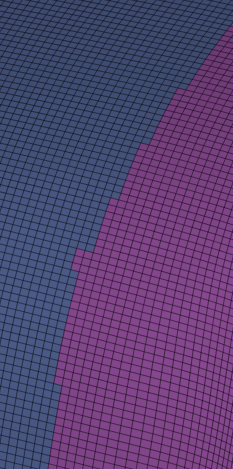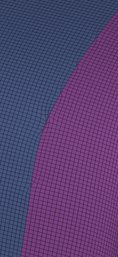

:::

## Deleting & Dissolving

|      Functionality      | Hotkeys & Notes                                                                                                                                                                                                                                                                                               |
| :---------------------: | :------------------------------------------------------------------------------------------------------------------------------------------------------------------------------------------------------------------------------------------------------------------------------------------------------------ |
|        **Delete**       | 🟠 **Delete** (`X`) 🔵 **Delete Face** (`Del`)                                                                                                                                                                                                                                                             |
|     **Soft Delete**     | 🟠 **Dissolve** (`Ctrl` + `X`) Works well on edges but not that well on vertices. [doc](https://docs.blender.org/manual/en/latest/modeling/meshes/editing/mesh/delete.html) 🔵 **Delete Vertex & Edge** (`Del`) 🔵 **Delete Vertex & Edge** (`Ctrl` + `Del`) An alternate, more aggressive soft delete. |
| **Delete by Attribute** | ⚪ **Delete Hidden** (*Tool > Geometry > Modify Topology > ...*) Use selection tools to hide parts of the mesh you want to delete. ⚪ **Delete By Symmetry** (*Tool > Geometry > Modify Topology > ...*) Deletes one side of the model based on selected axis.                                               |

## Remeshing, Retopology & Filling

|                    Functionality                   | Hotkeys & Notes                                                                                                                                                                                                                                                                                                                                                                                                                                                                                                                                                                                                                                                                                                                                                                                                                                                                                                                                  |
| :------------------------------------------------: | :----------------------------------------------------------------------------------------------------------------------------------------------------------------------------------------------------------------------------------------------------------------------------------------------------------------------------------------------------------------------------------------------------------------------------------------------------------------------------------------------------------------------------------------------------------------------------------------------------------------------------------------------------------------------------------------------------------------------------------------------------------------------------------------------------------------------------------------------------------------------------------------------------------------------------------------------- |
| **Retopologizer (Uniform Quad Based Remesher)** | ⚪ **ZRemesher** *(Tool > Geometry > ...)* A very powerful retopology algorithm that can be influenced with guiding lines and PolyPaint to determine the local density as well as a handful of options. For some strange reason it's unable to properly remesh smaller objects. ([Showcase by Hart](https://www.youtube.com/watch?v=0fEC6Tr9CC8)) 🔵 **Retopologize** *(Poly Modeling Shelf)* An equally mighty retopo algorithm to ZBrush's. Remeshing beforehand will produce significantly better edge loop flow, more on that Maya tool shortly. ([Showcase by Autodesk](https://www.youtube.com/watch?v=-K1yCo2e6W8)) 🟠 **Quad Remesher add-on** *([exoside](https://exoside.com/))* Made by the ZRemesher developer.                                                                                                                                                                                                                 |
|                 **Basic Remesher**                 | ℹ️ *Good for the block out and silhouette finding stages.*  ⚪ **DynaMesh** *(Tool > Geometry > DynaMesh)* Fills up holes. 🔵 **Remesh** *(Poly Modeling Shelf)* A triangle based remesher with a good amount of options, very useful in conjunction with Maya's retopologize tool. (Interpolation Type **Linear** is mostly better for preserving the shape on hard surface objects, while **Hybrid** is better for organic shapes.) 🟠 **Remesh** *(`Ctrl` + `R` In Sculpting Mode)* Remeshing takes very long and yields not the best of results. Sometimes even generates zero length edges. Doesn't work properly if holes are present. `Shift` + `R` to determine voxel size. 🟠 **Decimate modifier**. The decimation modifier is a type a remesher that reduces mesh density while trying not to lose the mesh's shape. It uses a very basic algorithm that only takes stuff like planarness and edge angles into account. |
|                **Dynamic Remesher**                | ℹ️ *Can be useful for block out stages, or adding in small details without disrupting the rest of the mesh. I don't, however, recommend this type of remesher for beginners, as it developes bad sculpting habits.*  ⚪ **Sculptris Pro** *(Stroke > ...)* Constantly remeshes the parts of the mesh the brush touches. Remesh density based on the current brushes size or a set value. 🟠**Dyntopo** *(?)* Same as Sculptris Pro, but it can also adapt the density based on viewport camera distance to mesh.                                                                                                                                                                                                                                                                                                                                                                                                                         |
|               **Retopology by Hand**               | *More on retopology on the Topology & Retopology page.*  🟠 Blender is amazing at retopology by hand. The tools it has are: Shrinkwrap modifier, Snap to surface, Relax Topology Brush (I recommend staying away from the Flipped Normal Retopology add-on, as it's buggy and extremely laggy.) 🔵 *ToDo*  [Topo Gun](http://www.topogun.com/) is also a great retopology software.                                                                                                                                                                                                                                                                                                                                                                                                                                                                                                                                               |
|                      **Fill**                      | 🟠 **Fill** (`F`) Connects all selected vertices with a ngon face. Can also connect two vertices with an edge. [doc](https://docs.blender.org/manual/en/latest/modeling/meshes/editing/face/fill.html) 🟠 **Grid Fill** *(Face > Grid Fill)* Good for big holes, can match curvature. 🟠 **Bridge Edge Loops** (`RMB` *> ...*) 🟠 **Fix Holes** *ToDo* 🔵 [Quad Fill Hole Script](https://www.artstation.com/marketplace/p/dRAM/maya-gn-quad-fill-hole) 🔵 **Fill Hole** (`Shift` + `RMB` > ...)  🔵 **Bridge** (`Shift` + `RMB` > ...) 🔵 **Append to Polygon** (*Mesh Tools > ...*) 🔵 Using curves as shown [here](https://www.youtube.com/watch?v=pIlxDVBRkRU) ⚪ **Close Holes** (*Tool > Geometry > Modify Topology > ...*)                                                                                                                                                                                      |

🔵 Comparison between using Maya's Remesh followed Retopologize (green) and just directly using Retopologize.
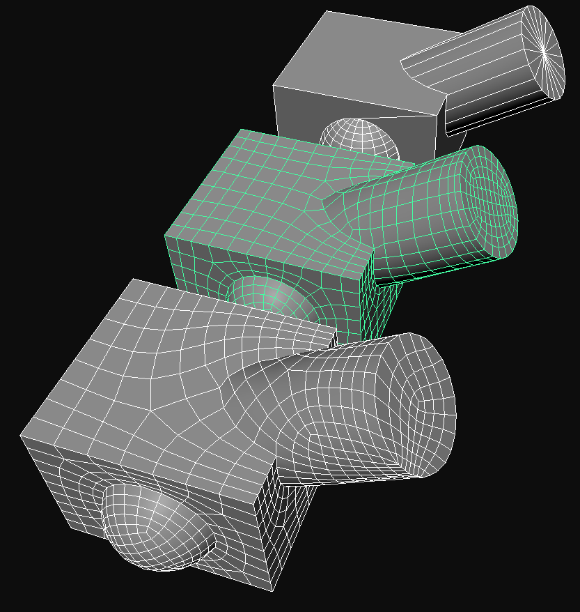
As one can see, Remeshing beforehand allows for the Retopologize algorithm to do a much better job.

## Subdividing

More on the Subdivision Surface algorithm [here](/notes/theory/glossary#subdivision-surface).

|        Functionality        | Hotkeys & Notes                                                                                                                                                                                                                                                                                                                                                                                                                                                                                                                                                                                                                                                                                                                                                                                                                                                                                                                                                |
| :-------------------------: | :------------------------------------------------------------------------------------------------------------------------------------------------------------------------------------------------------------------------------------------------------------------------------------------------------------------------------------------------------------------------------------------------------------------------------------------------------------------------------------------------------------------------------------------------------------------------------------------------------------------------------------------------------------------------------------------------------------------------------------------------------------------------------------------------------------------------------------------------------------------------------------------------------------------------------------------------------------- |
| **Destructive Subdivision** | ℹ️ *This type of subdivision is destructive and will irreversibly change the geometry's shape.*  🟠 **Subdivide** (`RMB`*> ...) 🔵 **Smooth** (`Shift` + `RMB`*> ...\_) ⚪ Using ZBrush's smart subdivisions together with the *Del Lower* button                                                                                                                                                                                                                                                                                                                                                                                                                                                                                                                                                                                                                                                                                                   |
|    **Smart Subdivisions**   | ℹ️ *This type of subdivision pioneered by ZBrush, allows for navigating up and down subdivisions at any time while remembering changes made on each subdivision level individually. This allows for sculpting fine details, like pores, while still going back and editing the broader shapes without disrupting the detail.*  ⚪ **SDiv** (*Tool > Geometry*) `Ctrl` + `D` to add new levels. `D` to navigate up one level and `Shift` + `D` down one level. Use the *Del Higher* button to get rid of levels and *Del Lower* to set a new baseline. 🟠 **Multiresolution modifier** *ToDo* 🟠 *ToDo (Cover Blender add-ons that can do this. ([Sculpt Layers](https://blendermarket.com/products/sculpt-layers)))*                                                                                                                                                                                                                                |
|   **Dynamic Subdivisions**  | ℹ️ *These subdivisions are mostly only visual and are applied in real-time over the mesh. Dynamic subdivisions are mostly used as a preview and can, depending on the software, be turned into actual subdivisions.*  🟠 **Subdivision Surface modifier**. Toggling *Use Crease* under *Advanced* can be useful. Also make sure the modifiers are on the desired rendering mode, one could for example set the SubDs to *Render* mode only, saving performance in the *Realtime* view (there are however also add-ons for managing this kind of stuff). 🔵 **Smooth Mesh** (`2` / `3` / `1`) Under options (*Attribute Editor > "Object Name" > Smooth Mesh & Subdivision Levels*) one can change enable a preview of the wireframe and change the levels. ⚪ **Dynamic Subdiv** (*Tool > Geometry > ...*) `D` / `Shift` + `D` can be used as hotkeys to turn it ON or OFF, as long as the SubTool doesn't already have regular subdivision levels. |
|    **Un-Subdivide Mesh**    | ℹ️ *Un-subdividing can work in specific, quad only situations, but will mostly yield strange and unpredictable results. (Try subdividing and un-subdividing a mesh repeatedly and see what happens.)*  🟠 **Un-Subdivide** (`RMB` *> ...*) 🔵 **Unsmooth** (`Shift` + `RMB` *> ...*)                                                                                                                                                                                                                                                                                                                                                                                                                                                                                                                                                                                                                                                                  |

## Edge Control

Edge control (also referred to as pinching) can be achieved through adding:

* Bevels & Chamfers
* Edge Loops (via loop cuts, SubDs or remeshing)
* Creases

|         Functionality         | Hotkeys & Notes                                                                                                                                                                                                                                                                                                                                                                                                                                                                                                                                                                                                                                                                                                                                                                                                                                                                                                                                                                                                                                                                                                                                                                                                                                                                                                                                                                                                                                                                                                                                                                                                                                                                                                                                               |
| :---------------------------: | :------------------------------------------------------------------------------------------------------------------------------------------------------------------------------------------------------------------------------------------------------------------------------------------------------------------------------------------------------------------------------------------------------------------------------------------------------------------------------------------------------------------------------------------------------------------------------------------------------------------------------------------------------------------------------------------------------------------------------------------------------------------------------------------------------------------------------------------------------------------------------------------------------------------------------------------------------------------------------------------------------------------------------------------------------------------------------------------------------------------------------------------------------------------------------------------------------------------------------------------------------------------------------------------------------------------------------------------------------------------------------------------------------------------------------------------------------------------------------------------------------------------------------------------------------------------------------------------------------------------------------------------------------------------------------------------------------------------------------------------------------------ |
| **Bevels & Chamfers by Hand** | ℹ️ *Manually beveling gives the most control over the bevel shape and location, but needs good topology as a base, and can be time-consuming.*  🟠 **Bevel** (`Ctrl`+ `B`) `Scroll` changes segment count. `P` changes shape. Further options like bevel profile in pop-up menu. [doc](https://docs.blender.org/manual/en/latest/modeling/meshes/editing/edge/bevel.html) 🟠 **Vertex Bevel** (`Ctrl` + `Shift` + `B`) [doc](https://docs.blender.org/manual/en/latest/modeling/meshes/editing/vertex/bevel_vertices.html) 🔵 **Bevel** (`Ctrl`+ `B`) Can also bevel vertices, but that's currently broken. ⚪ **Bevel** (*ZModeler > ...*) Can only do chamfers, with 7 chamfer profiles to chose from. This nicely fits with ZBrush's SubD heavy workflows and allows for easy changing of bevel profiles by adding or removing loops, something that doesn't work with normal bevels. Taping other edges will instantly give them a bevel with the width of the previous bevel. Masking and selection can also be a great help when chamfering. ⚪ **Swivel & Delete** (*ZModeler > ...*) These two ZModeler actions can also create chamfers. ⚪ **Insert** (*ZModeler > ... with Interactive Elevation enabled*) Creates make shift bevels with arcs. ⚪ **Crease Bevel** (*Tool > Geometry > Crease > ...*) Places bevels along creases, slider for width below. Remember to remove the crease. ⚪ **Bevel Arc, Bevel Flat, hPolish, Trim Dynamic, Flatten & Planar Brushes**. An essential for hard surface sculpting. Also great for quick bevels on models with bad topology. 🟠 **Scrape & Flatten Brushes**. Blender has way fewer brushes for chamfering and beveling, Scrape feels nice, but Flatten feels kind of off. |
| **Dynamic Bevels & Chamfers** | 🟠 **Bevel Modifier** (*modifier shelf*) Same as the manual bevel, just that edges for beveling are chosen by angle, vertex groups or weighting. ⚪**Bevel Pro** (*ZPlugin > ...*) [Bevel Pro Tutorial by Michael Pavlovich](https://www.youtube.com/watch?v=6uvPmEqD4nY). Even works on terrible topology. Good ways to prepare for it, are using *Fix Mesh* (*Tool > Geometry > Mesh Integrity > ...*), *Weld Points* (*Tool > Geometry > Modify Topology > ...*) ⚪ **Dynamic SubDiv Menu** (*Tool > Geometry > ...*) This menu allows for all kinds of bevels and chamfers.                                                                                                                                                                                                                                                                                                                                                                                                                                                                                                                                                                                                                                                                                                                                                                                                                                                                                                                                                                                                                                                                                                                                                                           |
|       **Add Loop Cuts**       | 🟠🔵⚪ Refer to the [slicing and cutting](/notes/model-creation/modeling-and-sculpting#slicing--cutting) section.                                                                                                                                                                                                                                                                                                                                                                                                                                                                                                                                                                                                                                                                                                                                                                                                                                                                                                                                                                                                                                                                                                                                                                                                                                                                                                                                                                                                                                                                                                                                                                                                                                              |
|          **Creasing**         | ℹ️ *Creases can be transferred between ZBrush and Blender. Note that creases in Blender can go from 0% - 100%, but edges in ZBrush can only be creased or not.*  🟠 **Edge Crease** (`Shift` + `E`) Use selection tools like select by angle or select similar (`Shift` + `G`) to quickly crease edges in bulk. ⚪ **Edge Crease** (*ZModeler > ...*) ⚪ **Crease Polygroups Border** (*Tool > Geometry > Crease > ...*) Use this in combination with PolyGroup tools like group by angle.                                                                                                                                                                                                                                                                                                                                                                                                                                                                                                                                                                                                                                                                                                                                                                                                                                                                                                                                                                                                                                                                                                                                                                                                                                                          |

**Bevel Transitions**
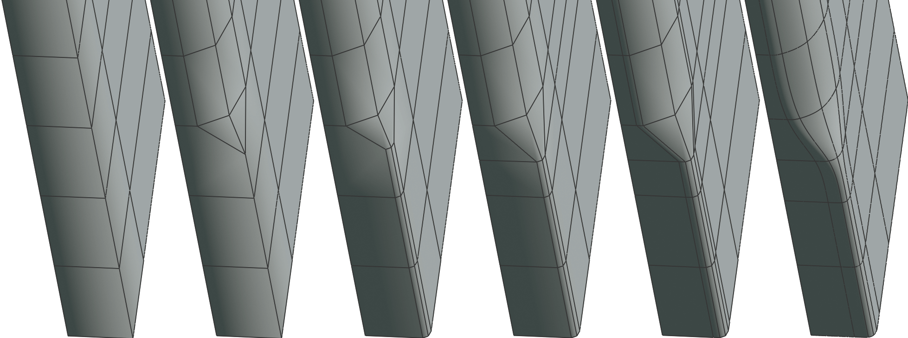
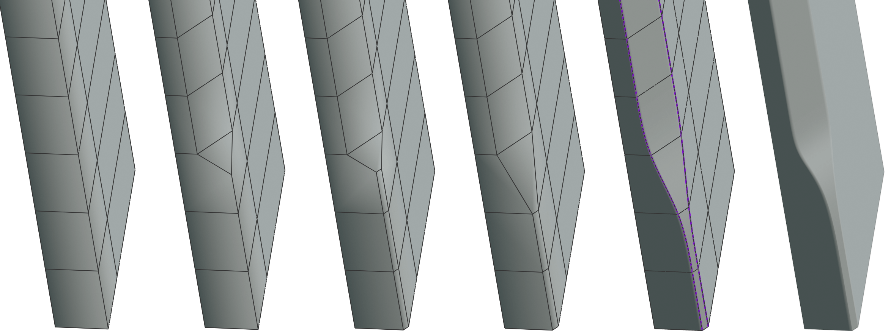

## Mirroring & Symmetry

Any kind of mirror action heavily depends on origin or pivot points, more on that [here](/notes/model-creation/modeling-and-sculpting#origin--pivot-points).

|      Functionality     | Hotkeys & Notes                                                                                                                                                                                                                                                                                                                                                                                                                                                                                                                                                                                                                                                                                                                                                                                                                                                           |
| :--------------------: | :------------------------------------------------------------------------------------------------------------------------------------------------------------------------------------------------------------------------------------------------------------------------------------------------------------------------------------------------------------------------------------------------------------------------------------------------------------------------------------------------------------------------------------------------------------------------------------------------------------------------------------------------------------------------------------------------------------------------------------------------------------------------------------------------------------------------------------------------------------------------ |
|    **Live Mirrors**    | 🟠 **Mirror Modifier** (*Modifier shelf*) Mirror point and rotation based on either the objects origin or that of any other object. Mirroring mirrors is very effective. ⚪ **Symmetry** (`X`) Options under *Transform > Activate Symmetry*. ⚪ **Radial Symmetry** (*Transform > Activate Symmetry, R*) Radial center point set by the selected symmetry axis. If the radial symmetry points are still not as desired, enable *Local Symmetry* or change the SubTools pivot point.  ⚪ **Posable Symmetry** (*Transform > Activate Symmetry + Use Posable Symmetry*) Posable Symmetry is incredible, as long as the topology is the same on both sides of the mesh, one can break symmetry and later on resume with symmetry and ZBrush will recognize matching vertices even if they are at different positions. *Pen Mask* will work, *Lasso Mask* however not. |
| **Single Use Mirrors** | 🟠 **Symmetrize** (*Mesh > ...*) 🟠 **MESHmachine add-on** (`Alt` + `X`) Mirrors and welds vertices at mirror point. [link](https://machin3.gumroad.com/l/MESHmachine) 🔵 **Mirror** (`Shift` + `RMB` *> ...*) Mirror point and rotation based on either objects origin, world center or the transform manipulator. Enable *Cut Geometry* to fuse meshes at mirror point and prevent overlaps. Setting *Border* to *Do not merge borders* will prevent vertices from merging at the mirror point. ⚪ **Mirror And Weld** (*Tool > Geometry > Modify Topology > ...*) Mirrors from +X to -X along world center and then welds both halves together. On the button, one can enable Y and Z axis as well.                                                                                                                                                            |
|      **Flip Mesh**     | ⚪ **Mirror** (*Tool > Deformation > ...*) Flips the mesh along the world center from one side to the other, depending on the selected mirror axis. 🟠 **Mirror Vertices** (`RMB` *> ...*) Will depend on what mode the *Transform Pivot Point* is set to.                                                                                                                                                                                                                                                                                                                                                                                                                                                                                                                                                                                                           |

:::tip[Custom Mirror Axis in ZBrush]
To circumvent the issue of not being able to set one's own mirror axis in ZBrush, use S.Pivot / C.Pivot.
:::

## Booleans

*ToDo*

## Morphing

**⚪ Morphs**
(*Tool > Morph Target*)

A snapshot of the current mesh is stored with *StoreMT*. With this stored morph, new strokes ignore each other, which is useful in many situations.

Here's an example of how it has great synergy with brushes like chisel and layer.

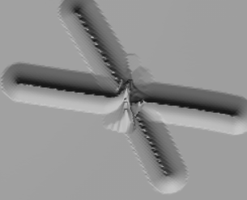
*(Without Morph Target)*

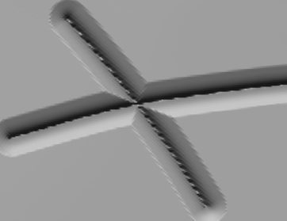
*(With Morph Target Stored)*

While a morph target is stored, one can use the *Morph Brush* to bring back parts of the stored morph. Or in more practical terms, erase strokes that were done after the morph was stored.

*Morphs* and *layers* also have a great synergy, as showcased in [this](https://www.youtube.com/watch?v=8oU7ZnTSkHA) video.

🟠 **Shape Keys**
*ToDo*

⚪ **Layers**
*ToDo*

* Note that ZBrush's layers currently don't properly work with Dynamic SubD and will show the model as black

## Reprojecting Detail

This is an essential technique which allows for the transfer of detail for a DynaMeshed mesh, to a nicely Zremeshed mesh. (This is also referred to as recreating subdivision levels.)

⚪ **Reprojecting Detail in ZBrush**

1. Apply SubDiv levels to SubTool
2. ZRemesh model
3. Duplicate SubTool
4. Go to the original SubTool (the one with history) and turn back the history right before the ZRemesh action
5. Hide all other objects except for these two
6. Then select the ZRemeshed duplicate. Add one SubDiv level and click ProjectAll. Repeat this step however often

[Flipped normals showcase](https://www.youtube.com/watch?v=Zp07GW3rND0) - [other showcase](https://www.youtube.com/watch?v=w22kX6Rz0yo)

🟠 **Reprojecting Detail in Blender**
*ToDo*

* combination of multires, subD and shrinkwrap modifier

## Fusing Meshes

|        Functionality        | Hotkeys & Notes                                                                                                                                                                                                                                                                                                                                                                                                                                                                                                                                                                                                                                                                                                                                                                                                                                                                                                                                                                                                                                                                                                                                                                                                                                                                                                                                                                                                                                                                                                                                                                                                                                                                                                                                                                                                                                                                               |
| :-------------------------: | :-------------------------------------------------------------------------------------------------------------------------------------------------------------------------------------------------------------------------------------------------------------------------------------------------------------------------------------------------------------------------------------------------------------------------------------------------------------------------------------------------------------------------------------------------------------------------------------------------------------------------------------------------------------------------------------------------------------------------------------------------------------------------------------------------------------------------------------------------------------------------------------------------------------------------------------------------------------------------------------------------------------------------------------------------------------------------------------------------------------------------------------------------------------------------------------------------------------------------------------------------------------------------------------------------------------------------------------------------------------------------------------------------------------------------------------------------------------------------------------------------------------------------------------------------------------------------------------------------------------------------------------------------------------------------------------------------------------------------------------------------------------------------------------------------------------------------------------------------------------------------------------------- |
|   **Fusing with Remesher**  | ℹ️ *Most remesher will try to fuse anything that gets close to each other, making them a great option for fusing meshes together.*  ⚪ **DynaMesh** (*Tool > Geometry > DynaMesh*) 🟠 **Remesh** (*Sculpt mode > ...*)                                                                                                                                                                                                                                                                                                                                                                                                                                                                                                                                                                                                                                                                                                                                                                                                                                                                                                                                                                                                                                                                                                                                                                                                                                                                                                                                                                                                                                                                                                                                                                                                                                                                |
|    **Other Fusing Tools**   | ⚪ **Mesh Fusion**. Turn off DynaMesh, then place an insert brush with an open back over a Polygroup (insert brushes with "H" in the name will mostly be open-ended). Finally clear the mask twice (`Ctrl` + `LMB-drag`).  [zbrush doc](https://help.maxon.net/zbr/en-us/Content/html/user-guide/3d-modeling/topology/mesh-fusion/mesh-fusion.html) - [Mesh Fusion Basics by Michael Pavlovich](https://www.youtube.com/watch?v=frxGss8_XBY&) - [Mesh Fusion showcase by Zbrush3Dinfo](https://www.youtube.com/watch?v=jylEGfZL-kU) - [Mesh Fusion Basics by Maxon](https://www.youtube.com/watch?v=jylEGfZL-kU)                                                                                                                                                                                                                                                                                                                                                                                                                                                                                                                                                                                                                                                                                                                                                                                                                                                                                                                                                                                                                                                                                                                                                                                                                                                                            |
| **Fusing with Shrink Wrap** | 🟠 In short, this method uses vertex groups to gradually introduce the shrinkwrap effect, as well as the data transfer modifier to make the connection look flush.  1. Set the attacher object's origin point to where it should connect with the foundation object (sometimes it can make sense to lower the origin point at the end for better results) 2. Then snap (`Shift` + `Tab`) it to the foundation object, with the following snap settings: Snap With = Median, Snap To = Face, Align Rotation to Target = On 3. Next remove the objects floor. Then extrude, the now open edge, outwards and bevel the newly created sharp corner with 5 segments. Lastly, delete the outermost edge ring. 4. Create a vertex group and assign the edge rings of the attacher object. Start with the outermost ring and give it a weight of 1, then work yourself up the chain of edge rings decreasing the weight by a linear amount (like 1, 0.8, 0.6, 0.4, 0.2, 0) until the last ring that holds the attacher object's original shape has a weight of 0. (This is why it's important to have the right amount of edge rings from the prior step.) 5. Then add a Shrinkwrap modifier with the following settings: Snap Mode = Outside Surface, Target = foundation object, Vertex Group = the one you just created 6. Finally, to make the transfer between both objects flush, add a Data Transfer modifier with the following settings: Source = foundation object, Vertex Group = the one you just created, Face Corner Data > Custom Normals = On 7. Depending on the viewport settings there might still be a seam, which will disappear when disabling *Shading > Outline*  If still unclear, [this](https://www.youtube.com/watch?v=l1AZybSzl8w) video form Blender Secrets shows it off.  <Image src={ykkqak} alt="" width="450" height="auto" /> |

## Deforming

|       Functionality       | Hotkeys & Notes                                                                                                                     |
| :-----------------------: | :---------------------------------------------------------------------------------------------------------------------------------- |
| **Deforming Entire Mesh** | ⚪ **Transpose Gizmo Cog Wheel**. Amazing suite of deformations and transformations. 🟠 **Bend & other Deform Modifiers**. *ToDo* |

🟠 **Perfectly Bend One Object Along the Surface of Another**

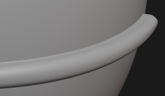

1. Make sure the origin is at the point where the object should connect with the target object
2. Extrude outwards at the connection point. And add a 4 segment bevel at the lowest corner
3. Make a vertex group and assign every edge loop a different weight. Starting at the outermost loop with a weight of 1. Give the second outermost a weight of 0.8 and so on. After assigning weight 0.2 stop.
4. Set cursor to object origin. Add a grid, and turn on wireframe for that object. Then press F9 and adjust the grid topology density. The more curve the target has, the more dense the gird has to be.
5. Add a surface deform mod to the object. Target: Grid, Click Bind.
6. Apply scale and rotation for grid, object and parent object to grid
7. Add Shrinkwrap mod to gird. Snap Mode: Outside surface, Target: Target Object
8. Enable face snap. Snap With: Median, Align Rotation to Target. And place the grid on the target surface
9. Add DataTransfer mod on Object. Source: Target Object, Vertex Group: vertex group from 3., Face Corner Data: Custom Normals

## Input Devices

Sculpting in ZBrush or Blender requires some kind of pen controlled drawing surface, with or without a screen, accompanied by either a keyboard (preferably a small one, so it doesn't get in the way of the drawing tablet) or a special input device for artists (like the [TourBox](https://www.tourboxtech.com)). One can also get a tablet and use the iOS version of ZBrush.

Recommended mapping for a pen with 2 buttons:

|      Software     | Hotkeys & Notes                                                                                     |
| :---------------: | :-------------------------------------------------------------------------------------------------- |
|     **ZBrush**    | ⚪ **Front Stylus Button** ➡️ `RMB` ⚪ **Back Stylus Button** ➡️ *Hotkey to open your custom menu* |
|    **Blender**    | 🟠 **Front Stylus Button** ➡️ `MMB` 🟠 **Back Stylus Button** ➡️ *Hotkey for Quick Favorites*    |
|      **Maya**     | 🔵 *ToDo*                                                                                           |
| Substance Painter | **Front Stylus Button** ➡️ `MMB` **Back Stylus Button** ➡️                                       |

For Blender I like to map *Frame Selected* to `MB5` and *Quick Favorites* to `MB4` on the mouse.

When using Blender with keyboards that have no numpad (TKL keyboards) one has to enable *Emulated Numpad* (*Preferences > Input > ...*), Blender doc on that [here](https://docs.blender.org/manual/en/latest/getting_started/configuration/hardware.html). Not much actually changes without a numpad and I personally prefer to use Emulated Numpad even on keyboards that have a numpad, as it moves all the important numpad functions to a more accessible place on the keyboard.

## Sculpting

Organic sculpting is something best learned by simply sculpting and watching others sculpt.

:::tip[Some general tips for sculpting]

* Try to adjust brush strength as little as possible and instead set up your stylus correctly
* Don't have the mindset that every sculpt will be a portfolio piece
* Jump around the sculpt instead of finishing one area. This has 2 main reasons. The first being, that one should first get the main shapes correct before moving on to smaller shapes and reasons two is, if one works on one area too long, one stops seeing mistakes
* Regularly check silhouette and proportions by zooming out, moving the head away from the screen and turning on ZBrush's silhouette preview

:::

Here two great videos to start with:

<iframe width="560" height="315" src="https://www.youtube-nocookie.com/embed/rkMH77hZ9xc?si=WsmqUwicpfUhDULC" title="YouTube video player" frameborder="0" allow="accelerometer; autoplay; clipboard-write; encrypted-media; gyroscope; picture-in-picture; web-share" referrerpolicy="strict-origin-when-cross-origin" allowfullscreen></iframe>

*(15 Blender and Zbrush Sculpting Tips by Outgang - 7min)*

<iframe width="560" height="315" src="https://www.youtube-nocookie.com/embed/zwn7EZczPjY?si=6A7H9RPUaWXqBeyE" title="YouTube video player" frameborder="0" allow="accelerometer; autoplay; clipboard-write; encrypted-media; gyroscope; picture-in-picture; web-share" referrerpolicy="strict-origin-when-cross-origin" allowfullscreen></iframe>

*(How you should Sculpt EVERYTHING! by J Hill - 27min)*

:::tip[Some more videos]

**Principles of Sculpting - Complete Guide to Zbrush - 1h 26min**

<iframe width="560" height="315" src="https://www.youtube-nocookie.com/embed/rkiNs3AQg_o?si=NGFeJGQ1ziPva9Fc" title="YouTube video player" frameborder="0" allow="accelerometer; autoplay; clipboard-write; encrypted-media; gyroscope; picture-in-picture; web-share" referrerpolicy="strict-origin-when-cross-origin" allowfullscreen></iframe>

**Top Tips for Improving Your Sculpts in ZBrush by Flipped Normals - 31min**

<iframe width="560" height="315" src="https://www.youtube-nocookie.com/embed/3boCwp9uLsY?si=8_-iT-PiT5P1W3nQ" title="YouTube video player" frameborder="0" allow="accelerometer; autoplay; clipboard-write; encrypted-media; gyroscope; picture-in-picture; web-share" referrerpolicy="strict-origin-when-cross-origin" allowfullscreen></iframe>

:::

Look in the [resource](/notes/resources) section, to find great sculpting and ZBrush related YouTube.

**Software**
To address the elephant in the room, yes ZBrush is required if one is interested in doing sculpting in a professional setting, software like Blender simply won't cut it. Even for private use, if one has the money to spare, one should definitely go with ZBrush, workflow wise it hat so much more to offer. In addition to that the entry fee for ZBrush is greatly reduced with the release of the iPad app, assuming one has an iPad. It functions nearly identical to ZBrush PC and anything missing will most likely be added sooner or later.

**ZBrush's Brush System**
Zbrush dynamically generates hotkeys for every brush. `B` opens the brush menu, pressing `C` after that shows all brushes that start with the letter C. Now with this filtered selection every brush will show a letter that if pressed will choose that brush. These letter mostly correspond to some part of the brushes name. Pressing `B` for example, would select the Clay Buildup brush, making the hotkey for that brush `B` + `C` + `B`.

Some essential brushes are: Clay Buildup, Standard, Dam Standard, Smooth, Trim Dynamic, hPolish, Move, Inflate, Layer, Pinch, Bevel Arc / Flat, Scribe Chisel and History Recall.

Although ZBrush has quite an impressive brush selection, often one needs extra brushes for specialized tasks. Here are some good Brushes and Insert Brushes from ArtStation and Gumroad:

* [Orb Brush Pack](https://orb.gumroad.com/l/nOkHw) (free)
* [Flipped Normals Skin Kit](https://flippednormals.com/downloads/flippednormals-skin-kit/) (paid)
* [550 Blender Brushes Stylized Edition](https://www.artstation.com/marketplace/p/80bz/megapack-550-blender-brushes-stylized-edition-4k-alphas-included) (paid)
* [Sculpting Brushes for Dragons, Lizards](https://www.artstation.com/marketplace/p/XPXl/vdm-and-sculpting-brushes-for-dragons-lizards-and-etc?utm_source=artstation\&utm_medium=referral\&utm_campaign=homepage\&utm_term=marketplace) (paid & free demo)
* [Igor Golovkov](https://www.artstation.com/astiil/store) (free & paid)
* [Flipped Normal Shop Sin Brushes](https://flippednormals.com/downloads/tag/skin/) (free & paid)

|     Functionality     | Hotkeys & Notes                                          |
| :-------------------: | :------------------------------------------------------- |
| **Change Brush Size** | ⚪ **Size** (`S`) 🟠 **Radius** (`F`)                  |
|     **Intensity**     | ⚪ **Intensity** (`U`) 🟠 **Strength** (`Shift` + `F`) |
|    **Focal Shift**    | ⚪ **Focal Shift** (`O`)                                  |
|   **Subtract Mode**   | ⚪ **Subtract** (`Alt`) 🟠 **Subtract** (`Ctrl`)       |

## ZModeler

ZModeler is a ZBrush brush that allows for poly modeling.

:::tip[All you need to get started with ZModeler]

Royal Skies has a great [playlist](https://www.youtube.com/playlist?list=PLZpDYt0cyiuvWir5Lmzf7NM7j27FOn2fp) covering everything about the ZModeler, as quickly as possible.

:::

**Basic controls:**

* Hovering a vertex, edge or face will bringe up a different menu when pressing `Space`
* Polygroups: `Alt` paint adds a white Polygroup and `Alt` painting over the same spot again restores the previous Polygroup color. To give the newly created white Polygroup it's unique color, one can after painting with `Alt`, continue holding down `LMB` and tap `Alt` to cycle through Polygroup colors. In addition, most ZModeler action will allow for pressing `Alt` mid action, to cycle Polygroups.

## Checking Mesh Stats & Integrity

*ToDo*

* (ZB) Tool > Analyze Selected SubTool
* (ZB) Preferences > Misc
* (ZB) Tool > Geometry > Mesh Integrity > Check Mesh Integrity
* (BL) 3D-Print Addon
* (BL) Viewport Overlays > Statistics

## Saves & Backups

*ToDo*

## History

*ToDo*

* Cover Maya's insanely powerful Attribute Editor

## Unit System & Sizing

*ToDo*

* (ZB) Unify: Resets location and sets scale as close as possible to 2 units cubed.

## Miscellaneous

|                    Functionality                    | Hotkeys & Notes                                                                                                                                                                                                                                                                                                                                                                                                                                                                                                                                                                                                                                                                                                                                                                                                                                                                                                                                                    |
| :-------------------------------------------------: | :----------------------------------------------------------------------------------------------------------------------------------------------------------------------------------------------------------------------------------------------------------------------------------------------------------------------------------------------------------------------------------------------------------------------------------------------------------------------------------------------------------------------------------------------------------------------------------------------------------------------------------------------------------------------------------------------------------------------------------------------------------------------------------------------------------------------------------------------------------------------------------------------------------------------------------------------------------------- |
|                      **Rename**                     | 🟠 **Rename** `F2`                                                                                                                                                                                                                                                                                                                                                                                                                                                                                                                                                                                                                                                                                                                                                                                                                                                                                                                                                 |
|                  **Camera Related**                 | 🟠 **Set View To Active Camera** (`0`) 🟠 **Set Active Camera To View** (`Ctrl` + `Alt` + `0`) 🟠 **Set Camera As Active Camera** (`Ctrl` + `0`) The active camera will be marked with an opaque black triangle above it.                                                                                                                                                                                                                                                                                                                                                                                                                                                                                                                                                                                                                                                                                                                                    |
| **Node Editors (Shader, Geometry & Compositor)** | ℹ️ Make sure the *Node Wrangler* add-on is on, so all of these hotkeys work.  🟠 Add Node (`Shift` + `A`) Pulling a node connection will also open the add menu. 🟠 **Duplicate Node** (`Shift` + `D` / `Ctrl` + `C`, `V`) 🟠 **Connect Selected Nodes Automatically** (`Shift` + `F`) Pretty smart and much faster than manually pulling connection between nodes. 🟠 **Pull a Node Out & Into a Connection** (`Alt` + `LMB-drag` / `LMB-drag` over connection line) 🟠 **Cut Node Connection** (`Ctrl` + `RMB-drag`) 🟠 **Delete Node** (`X`) 🟠 **Soft Delete Node** (`Ctrl` + `X`) Deletes selected nodes without breaking the connection. 🟠 **Mute Node** (`M`) 🟠 **Group Nodes** (`G`) Use `Tab` to enter and exit the group. 🟠 **Hide Node** (`H`) 🟠 **Connect Node to Viewer Node** (`Ctrl` + `Shift` + `LMB`) 🟠 **Add Mapping Setup** (`Ctrl` + `T` in shader editor) 🟠 **Reload Textures** (`Alt` + `R`) |

## Some Modeling Tricks

#### Diamond Grid

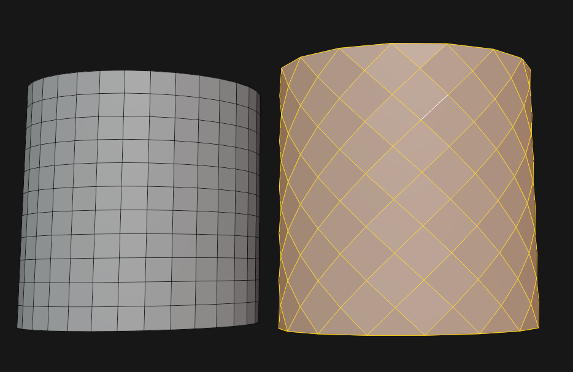

Used for fishnet stockings, fences and nets.

🟠 Un-Subdivide (`RMB` *> ...*) and set *Iterations* to "1"(*in pop-up menu*). 
🟠 *Poke Faces* (*Faces > ...*), then use *Tris to Quads* (Alt + J). 
🟠 *Armored Vitaly Poke* (`Space` > ...). Yields the best result. From the [ARMORED Toolkit](https://armoredcolony.gumroad.com/l/toolkit) add-on.

⚪ [Showcase by Michael Pavlovich](https://www.youtube.com/watch?v=wv3uNqr1Rf4)

#### Cushion

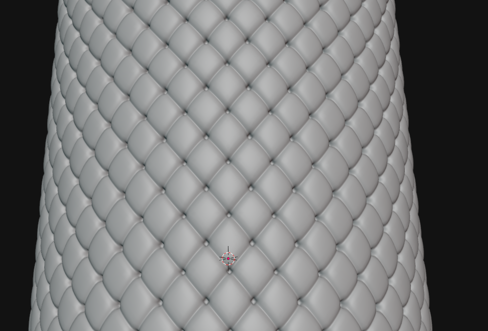

Great for seats, padding, cushions or puffy clothing.

🟠 [Armored Colony's Approach](https://youtu.be/HsBvq2j5zt8) 
🟠 Cloth Pro add-on

#### Connecting Circle with Square or Low Detail Circle

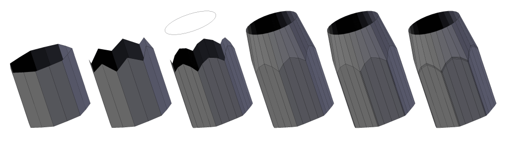

#### Fully Reset an Objects Data

Sometimes objects have data associated with them that is causing problems and can't be deleted. To reset the data of that object, simply add a primitive shape and merge the object with the problems into the newly created object. This method can also be used intentionally to quickly clean up and object.

#### Fix an Objects Pivot Point Orientation

Let's say one rotates an object and applies the transforms, but now want's the object the

If one applied transforms on an object that was rotated, but wants to reverse it then this simple method will help: (The alternative would be to eyeball it)

🟠

1. Find a flat and perfectly horizontal surface on the mesh (perfectly horizontal as in it's original orientation)
2. Select the face and use *Top* (*View > Align View > Align View To Active > ...*). This should make the camera look perfectly down upon that surface
3. Back in object mode add a cube (`Shift` + `A`), in and set *Align* to "View" (*in pop-up menu*)
4. Parent the object to the newly created cube
5. Finally clear the cubes rotation (`Alt` + `R`)
6. Lastly before deleting the helper cube, clear the parenting to the cube with keep transformation (`Alt` + `P`) and apply the rotation of the object that was just fixed (`Ctrl` + `A` *> Rotation*)

#### Thick Wireframe

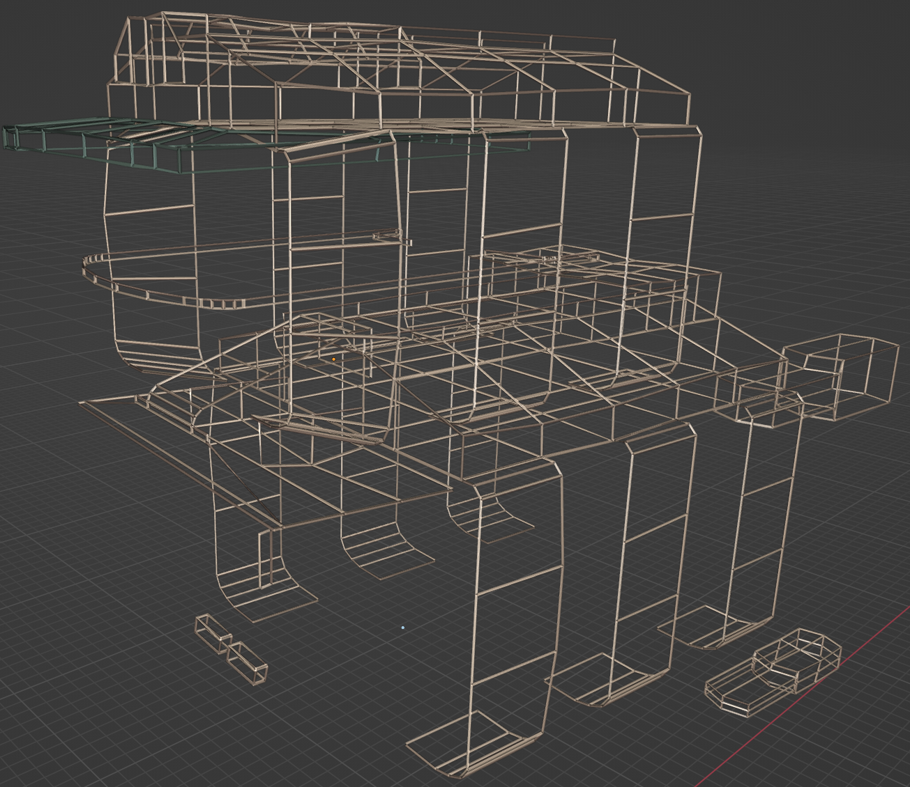
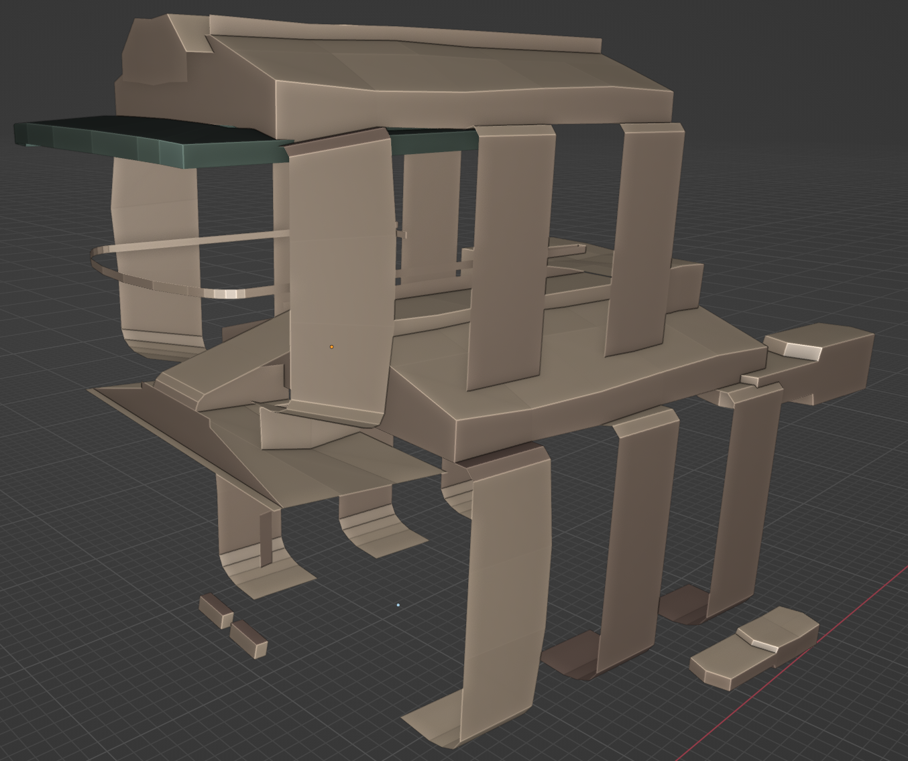

🟠**Wireframe modifier**

#### Interesting Skin Clothing Effect

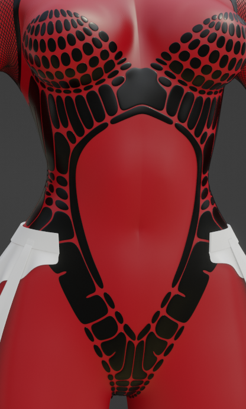

🟠**Edge Split at Just the Right Angle** 
Edge Split modifier set to specific angle amount. Then add modifiers like: Solidify, SubDiv, Bevel and Shrink Wrap.
