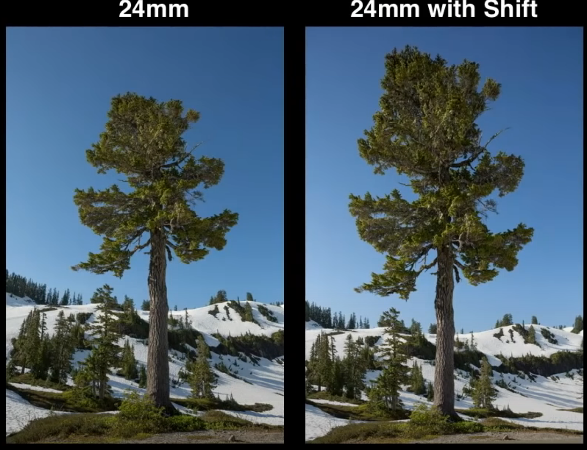
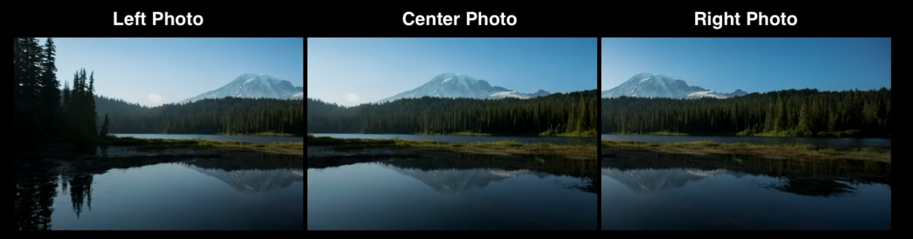
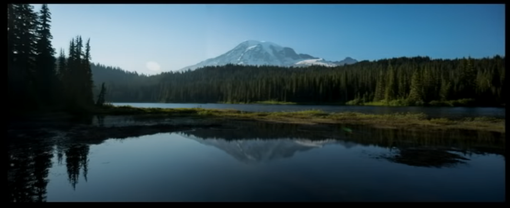

import { Image } from 'astro:assets'

import lcqtci from '../../../../assets/notes/images/pasted-image-20230604143244.png'

import bnsonp from '../../../../assets/notes/images/pasted-image-20230604144128.jpg'

import hjvyyc from '../../../../assets/notes/images/pasted-image-20230604144141.jpg'

import fzhtuk from '../../../../assets/notes/images/pasted-image-20230604144147.jpg'

import kbwwty from '../../../../assets/notes/images/pasted-image-20230604144201.png'

import eaolrd from '../../../../assets/notes/images/pasted-image-20230604144626.png'

import wedtmi from '../../../../assets/notes/images/pasted-image-20230604144633.png'

import syoxzu from '../../../../assets/notes/images/pasted-image-20230604144639.png'

import kjxffs from '../../../../assets/notes/images/pasted-image-20230604144646.png'

import jjejws from '../../../../assets/notes/images/pasted-image-20230604144653.jpg'

import rjycmq from '../../../../assets/notes/images/pasted-image-20230604160548.png'

import dbhjkw from '../../../../assets/notes/images/pasted-image-20230604160636.png'

import xzamlm from '../../../../assets/notes/images/pasted-image-20230604160650.png'

import jumjqr from '../../../../assets/notes/images/pasted-image-20230604160705.png'

import tvltsg from '../../../../assets/notes/images/pasted-image-20230604160718.png'

import zthfrr from '../../../../assets/notes/images/pasted-image-20230604160736.png'

import ssyqbq from '../../../../assets/notes/images/pasted-image-20230604160753.png'

import bxahvd from '../../../../assets/notes/images/pasted-image-20230604160811.png'

import xehxvf from '../../../../assets/notes/images/pasted-image-20230604160840.png'

import hhebqx from '../../../../assets/notes/images/pasted-image-20230604160917.png'

import fykjqj from '../../../../assets/notes/images/pasted-image-20230604160946.png'

import dojfuw from '../../../../assets/notes/images/pasted-image-20230604161014.png'

import ucqdaq from '../../../../assets/notes/images/pasted-image-20230604161032.png'

import fapwov from '../../../../assets/notes/images/pasted-image-20230604161107.png'

import vsakvt from '../../../../assets/notes/images/pasted-image-20230604161140.png'

import aafflp from '../../../../assets/notes/images/pasted-image-20230604161206.png'

import ckzwhc from '../../../../assets/notes/images/pasted-image-20230604161225.png'

import telvwd from '../../../../assets/notes/images/pasted-image-20230604161249.png'

import ovrjun from '../../../../assets/notes/images/pasted-image-20230604161413.jpg'

import qkzjja from '../../../../assets/notes/images/pasted-image-20230604161445.jpg'

import tnvnwy from '../../../../assets/notes/images/pasted-image-20230604161502.png'

import pmkfzs from '../../../../assets/notes/images/pasted-image-20230604161509.png'

import dzqpie from '../../../../assets/notes/images/pasted-image-20230604161531.png'

import nppkdn from '../../../../assets/notes/images/pasted-image-20230604161557.png'

import edhaqp from '../../../../assets/notes/images/pasted-image-20230604161612.png'

import mlywry from '../../../../assets/notes/images/pasted-image-20230604161708.png'

import gqamsv from '../../../../assets/notes/images/pasted-image-20230604161717.png'

import xpdupc from '../../../../assets/notes/images/pasted-image-20230604161723.png'

import wlenkb from '../../../../assets/notes/images/pasted-image-20230604161729.png'

import zisbhr from '../../../../assets/notes/images/pasted-image-20230604161736.png'

import gqcoze from '../../../../assets/notes/images/pasted-image-20230604161749.png'

import thoejj from '../../../../assets/notes/images/pasted-image-20230604161922.png'

import mhhlmz from '../../../../assets/notes/images/pasted-image-20230604161940.png'

import wzwisv from '../../../../assets/notes/images/pasted-image-20230604162002.png'

import xkievz from '../../../../assets/notes/images/pasted-image-20230604162027.png'

import zranqr from '../../../../assets/notes/images/pasted-image-20230604162039.png'

import zisqbl from '../../../../assets/notes/images/pasted-image-20230604162125.png'

import asggnh from '../../../../assets/notes/images/pasted-image-20230604162416.png'

## Table of Contents

* [Focal Elements and Emphasis](/notes/theory/composition#focal-elements-and-emphasis)
* [Balance](/notes/theory/composition#balance)
* [Positioning and Movement Direction](/notes/theory/composition#positioning-and-movement-direction)
* [Tilt Shift Camera](/notes/theory/composition#tilt-shift-camera)

## Focal Elements and Emphasis

Focal Elements and Emphasis dictates the rough order in which the eye looks at the different elements of the artwork. This doesn't just apply to static renders, but composition can also be achieved in games and even outside of cutscenes.

Great composition is achieved through:

* [Color, Saturation and Contrast](/notes/theory/composition#color-saturation-and-contrast)
* [Placement of Key Elements](/notes/theory/composition#placement-of-key-elements)
* [Negative Space](/notes/theory/composition#negative-space)
* [Energy Lines](/notes/theory/composition#energy-lines)
* [Guiding Lines](/notes/theory/composition#guiding-lines)
* [Framing](/notes/theory/composition#framing)
* Camera Focus
* Motion
* Faces and Figures
* Geometric Shapes

[Other Elements and Emphasis Examples](/notes/theory/composition#other-elements-and-emphasis-examples)

[Bad Examples](/notes/theory/composition#bad-examples)

:::tip[Understanding composition (videos)]

<iframe width="560" height="315" src="https://www.youtube-nocookie.com/embed/JuEkb6FNptE?rel=0" title="YouTube video player" frameborder="0" allow="accelerometer; autoplay; clipboard-write; encrypted-media; gyroscope; picture-in-picture; web-share" allowfullscreen></iframe>
<iframe width="560" height="315" src="https://www.youtube-nocookie.com/embed/O8i7OKbWmRM?rel=0" title="YouTube video player" frameborder="0" allow="accelerometer; autoplay; clipboard-write; encrypted-media; gyroscope; picture-in-picture; web-share" allowfullscreen></iframe>
<iframe width="560" height="315" src="https://www.youtube-nocookie.com/embed/Zbi_XUtb1Mk?rel=0" title="YouTube video player" frameborder="0" allow="accelerometer; autoplay; clipboard-write; encrypted-media; gyroscope; picture-in-picture; web-share" allowfullscreen></iframe>
<iframe width="560" height="315" src="https://www.youtube-nocookie.com/embed/VArISvUuyr0?start=9&rel=0" title="YouTube video player" frameborder="0" allow="accelerometer; autoplay; clipboard-write; encrypted-media; gyroscope; picture-in-picture; web-share" allowfullscreen></iframe>

:::

### Color, Saturation and Contrast

Bolder colors for more important things and duller, muted color for less important things. If the entire piece is very dark, then lighter colors will pull focus, and when it's very light, darker colors will draw a viewer's attention towards them.

### Placement of Key Elements

#### Golden Ratio

The **golden ratio**, also known as the **golden mean** or the **Fibonacci sequence** can be achieved by placing the key elements in the "eye of the storm". To achieve this, the frame is recursively split with a ratio of 1 to 1.68.

<Image src={lcqtci} alt="" width="400" height="auto" />

:::tip[Other Golden Ratio examples]

<Image src={bnsonp} alt="" width="700" height="auto" /> <Image src={hjvyyc} alt="" width="700" height="auto" /> <Image src={fzhtuk} alt="" width="700" height="auto" />

And one more for laughs

<Image src={kbwwty} alt="" width="700" height="auto" />

:::

#### Rule of Thirds

The **rule of thirds** isn't just used to place important points, but also to determine other things like:

The **rule of thirds** can be used to determine a number of artistic decisions:

* Surfaces where light hits vs. shadows
* How much skin of the character should be revealed
* The ratio between shiny and matte materials
* The ratio of one color vs. another color
* Where to place key elements

:::tip[1/3 stands out more than the 2/3.] 
:::

<Image src={eaolrd} alt="" width="600" height="auto" />

:::tip[Other Rule of Thirds examples]

<Image src={wedtmi} alt="" width="800" height="auto" /> <Image src={syoxzu} alt="" width="700" height="auto" /> <Image src={kjxffs} alt="" width="700" height="auto" /> <Image src={jjejws} alt="" width="700" height="auto" />

:::

#### Triangle / Pyramid

This composition method is good for character shots.

<Image src={rjycmq} alt="" width="250" height="auto" />

:::tip[Other Triangle examples]

<Image src={dbhjkw} alt="" width="250" height="auto" /> <Image src={xzamlm} alt="" width="300" height="auto" /> <Image src={jumjqr} alt="" width="400" height="auto" /> <Image src={tvltsg} alt="" width="500" height="auto" /> <Image src={zthfrr} alt="" width="700" height="auto" /> <Image src={ssyqbq} alt="" width="400" height="auto" />

:::

One reason why the triangle is a good composition method, is because it's a sturdy shape:

<Image src={bxahvd} alt="" width="250" height="auto" />

#### Flipped Triangle

The flipped triangle is a more dynamic version of the triangle composition; it can also be tilted to become a bit more interesting.

<Image src={xehxvf} alt="" width="300" height="auto" />

:::tip[Other Flipped Triangle examples]

<Image src={hhebqx} alt="" width="350" height="auto" />

:::

#### Symmetry

Good to signal power, of a building for example. Symmetry line can be anywhere.

Symmetry signals power and dominance. This is prominently used in buildings, monuments, and nature. The line of symmetry can be anywhere.

<Image src={fykjqj} alt="" width="250" height="auto" />

:::tip[Other Symmetry examples]

<Image src={dojfuw} alt="" width="700" height="auto" /> <Image src={ucqdaq} alt="" width="700" height="auto" />

:::

#### Full Frame

Is a composition type primarily used for characters and creatures. A great thing about it, is that it can be achieved with basically every finished piece by cropping the sides and doing some small tweaks. Nonetheless, it's better to prepare for a full frame composition from the beginning, rather than as an afterthought.

<Image src={fapwov} alt="" width="250" height="auto" />

:::tip[Other Full Frame examples]

<Image src={vsakvt} alt="" width="400" height="auto" /> <Image src={aafflp} alt="" width="500" height="auto" /> <Image src={ckzwhc} alt="" width="300" height="auto" />

:::

### Negative Space

Positive space is a subject or point of interest and negative space is the surrounding area. More negative space gives the artwork space to breathe, while less negative space makes it more claustrophobic. Both can be good or bad, depending on what kind of mood the artwork should convey.

* *To-Do: Examples*

### Energy Lines

They are found in a character's pose; however, they can also appear in the environment, like in rivers and roads, for instance.

<Image src={telvwd} alt="" width="450" height="auto" />

### Guiding Lines

Guiding lines pull the eye along a path toward a specific position; when correctly deployed, they can encourage the viewer's eye to travel around the image the way the artist envisioned. An all-time favorite is open umbrellas because they so nicely guide the eye back into the artwork with their arch and can be held at any angle.

<Image src={ovrjun} alt="" width="450" height="auto" />

:::tip[Other Guiding Line examples]

<Image src={qkzjja} alt="" width="700" height="auto" /> <Image src={tnvnwy} alt="" width="700" height="auto" /> <Image src={pmkfzs} alt="" width="700" height="auto" />

:::

### Framing

Framing can be achieved through the following elements:

* Vignettes
* Big windows
* Openings to the sky among dense buildings
* Dense trees at the left and right leading to a point in the middle

<Image src={dzqpie} alt="" width="600" height="auto" />

:::tip[Other Framing examples]

<Image src={nppkdn} alt="" width="500" height="auto" /> <Image src={edhaqp} alt="" width="600" height="auto" />

:::

### Other Elements and Emphasis Examples

:::tip[Other elements / emphasis examples]

<Image src={mlywry} alt="" width="800" height="auto" /> <Image src={gqamsv} alt="" width="800" height="auto" /> <Image src={xpdupc} alt="" width="800" height="auto" /> <Image src={wlenkb} alt="" width="800" height="auto" /> <Image src={zisbhr} alt="" width="800" height="auto" /> <Image src={gqcoze} alt="" width="800" height="auto" />

:::

### Bad Examples

:::tip[Bad examples]

<Image src={thoejj} alt="" width="800" height="auto" /> <Image src={mhhlmz} alt="" width="800" height="auto" />

:::

## Balance

Some elements in an image create weight and need to be balanced by other elements.

Elements that create weight:

* Colors, saturation, and contrasts
* Size
* Faces and figures

<Image src={wzwisv} alt="" width="550" height="auto" />

A way to find unbalanced points, is to turn up the contrast and blur.

As illustrated by the example below, the presence of only one big light on the left makes the image very unbalanced:

<Image src={xkievz} alt="" width="400" height="auto" /> <Image src={zranqr} alt="" width="400" height="auto" />

In contrast, here's an example of how to balance an image properly:

<Image src={zisqbl} alt="" width="500" height="auto" />

## Positioning and Movement Direction

Moving to the left / right or forward / backward, and so on, can portray different things in an image or animation, like emotion, intent, and power. (This can also apply to the direction in which the character is facing.)

:::tip[Positioning and movement direction (videos, articles)]

<iframe width="560" height="315" src="https://www.youtube-nocookie.com/embed/Ys8-a0yD-MM" title="YouTube video player" frameborder="0" allow="accelerometer; autoplay; clipboard-write; encrypted-media; gyroscope; picture-in-picture; web-share" allowfullscreen></iframe>

* [Left or Right? Why a Character's Lateral Movement On-Screen Matters in Film](https://nofilmschool.com/2016/02/left-or-right-why-characters-lateral-movement-screen-matters-film)

:::

#### Left / Right

* **Moving from left to `RIGHT`:** Progression Of Time, Progress, Normality, To The Action *(Example: Soldiers running into battle to the right)*

* **Moving from right to `LEFT`:** Moving Back In Time, Regression, Abnormality, Back To Safety *(Example: Soldiers carrying wounded to the left)*

* **`Right` side of the screen:** Good, Positive

* **`Left` side of the screen:** Bad, Negative

#### Forward / Backward

* **Moving `Forward` / `Towards` the Camera\`:** Power, Domination/ Dominance, Aggression
* **Moving `Backward` / `Away` from the Camera:** Weakness

#### Top / Bottom

* **Moving `Up` / being at the `Top` / being `looked up` at:** Dominance, Power
* **Moving `Down` / being at the `Bottom` / `looking down` on:** Weak

#### Some Other Interesting Examples

* Most languages read from left to right
* Books begin at the left and end at the right
* Evolution images show evolution starting at the left
* In most platformers, one starts on the left and moves to the right of the map
* On graphs time increases as one moves to the right

## Tilt Shift Camera

Tilt shift is used to get straight lines in renders / photographs and for panoramas. It's mainly used in architectural contexts. It can also be employed in compositing, but that's a worst-case scenario. To achieve this, the camera should optimally be at an 90° angle, then one changes the shift amount on the desired axis. (In Blender, this is in the camera tab.)

<Image src={asggnh} alt="" width="950" height="auto" />

:::tip[Other Tilt Shift Examples]

:::

:::tip[Tilt shift (videos)]

<iframe width="560" height="315" src="https://www.youtube-nocookie.com/embed/OeAXYgMwbyw?start=8" title="YouTube video player" frameborder="0" allow="accelerometer; autoplay; clipboard-write; encrypted-media; gyroscope; picture-in-picture; web-share" allowfullscreen></iframe>
<iframe width="560" height="315" src="https://www.youtube-nocookie.com/embed/gvV5sINKnT8?start=24" title="YouTube video player" frameborder="0" allow="accelerometer; autoplay; clipboard-write; encrypted-media; gyroscope; picture-in-picture; web-share" allowfullscreen></iframe>

:::
